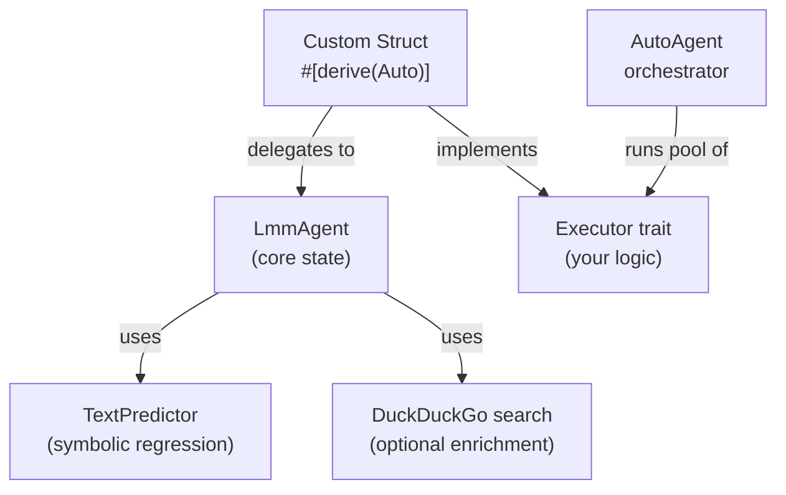

# LMM Agent Framework 🤖

The `lmm-agent` crate provides an equation-based, training-free autonomous agent framework built on top of the `lmm` core engine. Agents reason through symbolic mathematics, not neural networks: no GPU, no API key, no token quotas.

## 📦 Installation

```toml
# Cargo.toml
[dependencies]
lmm-agent = "0.0.2"
```

Or as a feature of the root `lmm` crate:

```toml
[dependencies]
lmm = { version = "0.2.2", features = ["agent"] }
```

## 🏗️ Core Architecture



## 🚀 Quick Start

```rust
use lmm_agent::prelude::*;
use async_trait::async_trait;

// Define your agent struct
// The `Auto` macro only requires one field: `agent: LmmAgent`
#[derive(Debug, Default, Auto)]
pub struct MyAgent {
    pub agent: LmmAgent,
}

// Implement only your task logic
#[async_trait]
impl Executor for MyAgent {
    async fn execute<'a>(
        &'a mut self,
        _tasks: &'a mut Task,
        _execute: bool, _browse: bool, _max_tries: u64,
    ) -> Result<()> {
        let prompt   = self.agent.behavior.clone();
        let response = self.generate(&prompt).await?;
        self.agent.add_message(Message::new("assistant", response));
        self.agent.update(Status::Completed);
        Ok(())
    }
}

// Run
#[tokio::main]
async fn main() {
    let agent = MyAgent::new(
        "Research Agent".into(),
        "Survey the Rust ecosystem.".into()
    );
    let _ = AutoAgent::default()
        .with(agents![agent]);
}
```

## 🔧 LmmAgent Builder

```rust
use lmm_agent::agent::LmmAgent;
use lmm_agent::types::{Message, Planner, Goal};

let agent = LmmAgent::builder()
    .persona("My Agent")
    .behavior("Summarise Rust papers.")
    .memory(vec![Message::new("system", "You are an LMM agent.")])
    .planner(Planner {
        current_plan: vec![Goal {
            description: "Read paper list.".into(),
            priority: 1,
            completed: false,
        }],
    })
    .build();
```

## 🧩 Key Types

| Type              | Purpose                                                      |
| ----------------- | ------------------------------------------------------------ |
| `LmmAgent`        | Core agent struct (memory, tools, planner, knowledge, etc.)  |
| `LmmAgentBuilder` | Fluent builder for `LmmAgent`                                |
| `Message`         | A chat message with `role` + `content`                       |
| `Status`          | `Idle`, `Active`, `InUnitTesting`, `Completed`, `Thinking`  |
| `Knowledge`       | Map of fact keys to natural-language descriptions            |
| `Planner`         | Ordered list of `Goal`s with priorities and completion flags |
| `Profile`         | Agent personality traits and behavioural script              |
| `ContextManager`  | Recent messages + current focus topics                       |
| `Task`            | Work unit with description, scope, URLs, and code fields     |
| `AutoAgent`       | Orchestrator that runs a pool of agents                      |

## 📡 AsyncFunctions Trait

The `Auto` derive macro generates:

```rust,ignore
// All below methods are generated automatically
async fn generate(&mut self, prompt: &str) -> Result<String>;
async fn search(&self, query: &str)         -> Result<Vec<LiteSearchResult>>;
async fn think(&mut self, goal: &str)       -> Result<ThinkResult>;
async fn save_ltm(&mut self, msg: Message)  -> Result<()>;
async fn get_ltm(&self)                     -> Result<Vec<Message>>;
async fn ltm_context(&self)                 -> Result<String>;
```

## 🔄 Agent Lifecycle

```sh
Idle → [execute() called] → Active → [task done] → Completed
                                   ↘ [think() called]   → Thinking → Completed
                                   ↘ [testing]          → InUnitTesting
```

## 📎 Further Reading

- [lmm-agent crate README](lmm-agent/README.md)
- [lmm-derive macro README](lmm-derive/README.md)
- [Full workspace README](README.md)
- [Custom agent example](lmm-agent/examples/custom_agent.rs)
