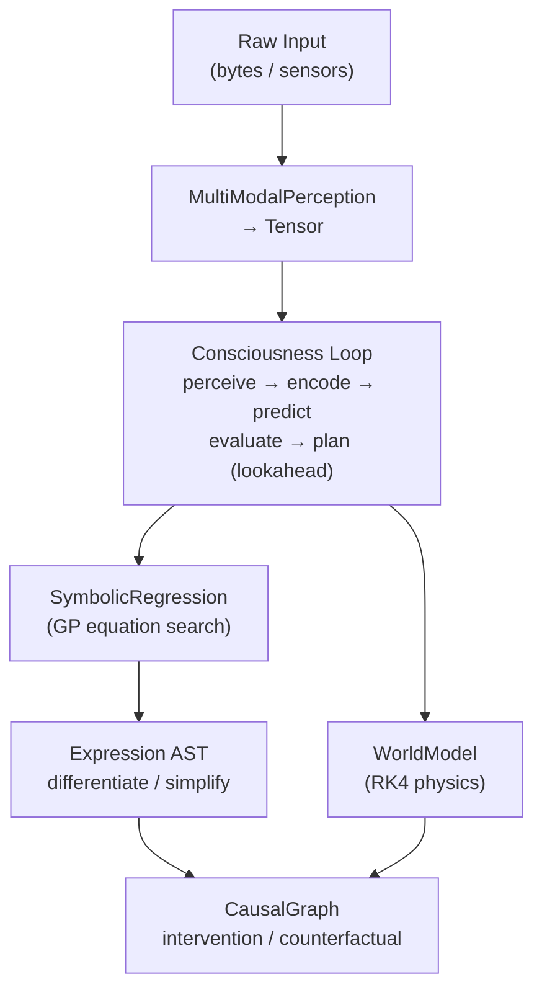

<div align="center">

# 👁️ LMM 🦀

[](https://wiseai.dev)

[](https://github.com/wiseaidotdev/lmm)
[](https://crates.io/crates/lmm)
[](https://docs.rs/lmm)
[](https://crates.io/crates/lmm)
[](https://pypi.org/project/lmm-rs/)
[](https://www.npmjs.com/package/@wiseaidev/lmm)
[](https://www.rust-lang.org/)
[](https://www.rust-lang.org)
[](LICENSE)
[](https://github.com/wiseaidev)

[](https://reddit.com/submit?url=https://github.com/wiseaidotdev/lmm&title=LMM%3A%20Large%20Mathematical%20Model%20%E2%80%94%20Encode%20Reality%20as%20Equations)
[](https://twitter.com/share?url=https://github.com/wiseaidotdev/lmm&text=LMM%3A%20Large%20Mathematical%20Model%20%E2%80%94%20Encode%20Reality%20as%20Equations)
[](https://www.linkedin.com/shareArticle?url=https://github.com/wiseaidotdev/lmm&title=LMM%3A%20Large%20Mathematical%20Model)

> **LMM (Large Mathematical Model)** is a pure‑Rust framework that models higher‑dimensional reality through symbolic mathematics and physics simulation; Inspired by the Pharaonic model of intelligence: compress the world into durable, universal equations. No training. No GPU. No API key.

| 🐧 Linux `(Recommended)` | 🪟 Windows | 🐳 Docker |
| :------: | :--------: | :--------: |
|  |  |  |
| [Download `lmm` binary](https://github.com/wiseaidotdev/lmm/releases/latest/download/lmm) | [Download `lmm.exe` binary](https://github.com/wiseaidotdev/lmm/releases/latest/download/lmm.exe) | `docker pull wiseaidev/lmm` |
| `cargo install lmm --features rust-binary` | `cargo install lmm --features rust-binary` | `docker run -it wiseaidev/lmm` |
| `lmm` ← launches CLI | `lmm` ← launches CLI | [Read DOCKER.md](https://github.com/wiseaidotdev/lmm/blob/main/DOCKER.md) |

</div>

## 🎬 Demo

The following demonstrates the symbolic prediction engine generating coherent English sentences powered entirely by deterministic mathematical equations and structural Subject-Verb-Object grammar; No neural networks, no statistical models. The engine supports a full suite of CLI subcommands including `predict`, `summarize`, `sentence`, `paragraph`, `essay`, and `ask`, enabling multi-paragraph construction driven entirely by mathematics.

| | | |
|:---:|:---:|:---:|
| <video src="https://github.com/user-attachments/assets/f20ed16f-d90e-4983-bc47-0de2ce5c5a4f"></video> | <video src="https://github.com/user-attachments/assets/680d4ef4-bab1-47d4-84e8-86a11aa93294"></video> | <video src="https://github.com/user-attachments/assets/299c280d-dcf3-484f-bf02-c37836811dcb"></video> |
| <video src="https://github.com/user-attachments/assets/06ef5c15-7743-4d62-908f-52d22288de76"></video> | <video src="https://github.com/user-attachments/assets/3b4bba24-012b-487b-98c8-91e61336cead"></video> | <video src="https://github.com/user-attachments/assets/fc1d0adc-e2c3-421a-b6b6-4b21dcf3af06"></video> |

## 🧠 What Does LMM Provide?

LMM bridges multimodal perception and actionable scientific discovery through five tightly integrated layers:

| Layer          | Modules                                       | Purpose                                                  |
| -------------- | --------------------------------------------- | -------------------------------------------------------- |
| **Perception** | `perception.rs`, `tensor.rs`                  | Raw bytes → normalised tensors                           |
| **Symbolic**   | `equation.rs`, `symbolic.rs`, `discovery.rs`  | GP symbolic regression, differentiation, simplification  |
| **Physics**    | `physics.rs`, `simulation.rs`                 | ODE models + Euler / RK4 / RK45 / leapfrog integrators  |
| **Causal**     | `causal.rs`                                   | SCM graphs, do-calculus interventions, counterfactuals   |
| **Cognition**  | `consciousness.rs`, `world.rs`, `operator.rs` | Full perceive → encode → predict → act loop              |

### ⚙️ Architecture



### 🔬 Key Capabilities

- 🧬 **Genetic Programming**: population-based symbolic regression with template seeding (linear, quadratic, periodic) and variable-enforcement guards.
- 📐 **Symbolic Calculus**: automatic differentiation (chain rule, product rule, trig) and constant-folding simplification.
- 🌀 **Physics Suite**: Harmonic Oscillator, Lorenz Attractor, Pendulum, SIR Epidemic, N-body Gravity; All implement `Simulatable`.
- 🔢 **Field Calculus**: N-D gradient, Laplacian, divergence, and 3-D curl via central differences.
- 🔗 **Causal Reasoning**: structural causal models, `do(X=v)` interventions, and counterfactual queries.
- 🧩 **Neural Operators**: circular convolution with SGD kernel learning and Fourier spectral operators.
- 🔤 **Text ↔ Equation**: losslessly encode any text string into a symbolic equation and recover it exactly via integer residuals.
- 🔮 **Symbolic Prediction**: equation-native text continuation using sliding-window GP regression and vocabulary anchoring.
- 🎲 **Stochastic Enhancement**: synonym-bank word replacement (`--stochastic`) delivers unique output each run while preserving mathematical sentence structure.
- 🎨 **Spectral Image Synthesis**: generate procedural PPM images from a text prompt by hashing it into Fourier wave components.

## 📦 Installation

The `lmm` crate ships the following Cargo features:

| Feature        | Description                                             |
| -------------- | ------------------------------------------------------- |
| `rust-binary`  | Enables the standalone `lmm` terminal CLI executable    |
| `cli`          | Core CLI scaffolding (subsets of `rust-binary`)         |
| `net`          | Internet-aware `ask` command via DuckDuckGo search      |
| `python`       | Python extension module via `pyo3` / maturin            |
| `node`         | Node.js native add-on via `napi-derive`                 |

## 🦀 Rust

The `lmm` library is available on [crates.io](https://crates.io/crates/lmm). For the complete API reference, installation guide, and worked examples, see the **[Rust usage guide](https://github.com/wiseaidotdev/lmm/blob/main/RUST.md)**.

## 💻 Command-Line Interface

The `lmm` binary supports 15 subcommands spanning simulation, discovery, encoding, prediction, summarisation, and rich text generation: all powered by pure equations.

For the full option reference and usage examples, see the **[CLI documentation](https://github.com/wiseaidotdev/lmm/blob/main/CLI.md)** or run `lmm --help` after installing with `cargo install lmm --features rust-binary`.

## 🐍 Python

The Python bindings are published to PyPI as **`lmm-rs`** and are installed with `pip install lmm-rs`. Built with [maturin](https://www.maturin.rs/), the package ships pre-compiled wheels for major CPython versions and runs a fully embedded Tokio runtime; no `asyncio` required.

For installation instructions, configuration options, and full method signatures, see the **[Python usage guide](https://github.com/wiseaidotdev/lmm/blob/main/PYTHON.md)**.

## 🟩 Node.js

The Node.js bindings are published to npm as **`@wiseaidev/lmm`** and are installed with `npm install @wiseaidev/lmm`. Built with [napi-rs](https://napi.rs/), the package ships a pre-compiled `.node` add-on with TypeScript type definitions.

For installation instructions, type definitions, and examples, see the **[Node.js usage guide](https://github.com/wiseaidotdev/lmm/blob/main/NODE.md)**.

## 🌐 WebAssembly (WASM)

LMM natively targets `wasm32-unknown-unknown`. Because `reqwest` switches to the browser `fetch` API automatically, you can deploy LMM inside Rust frontend frameworks such as **Yew**, **Dioxus**, and **Leptos** without any additional glue code.

For CORS considerations, build steps, and usage details, see the **[WASM usage guide](https://github.com/wiseaidotdev/lmm/blob/main/WASM.md)**.

## 🤖 Agent Framework

The `lmm-agent` crate extends LMM with a fully autonomous, equation-based agent layer; no LLM, no API key, no training data.

| Document | Description |
| -------- | ----------- |
| **[AGENT.md](AGENT.md)** | Architecture, quick-start, types, and async API reference |
| **[DERIVE.md](DERIVE.md)** | `#[derive(Auto)]` macro: generated traits and field contract |
| **[lmm-agent README](lmm-agent/README.md)** | Crate-level API reference, builder, and example |
| **[lmm-derive README](lmm-derive/README.md)** | Macro crate details and field rules |

## 📰 Publications & Research

The architecture, formal mathematics, and paradigm are fully documented in the official whitepaper:
**[Read the Whitepaper (PDF)](papers/lmm.pdf)**.

### Blog Posts

- [LLMs are Useful. LMMs will Break Reality](https://wiseai.dev/blogs/llms-are-usefull-lmms-will-break-reality): the original post that started this project.
- [Training Is An Evil Concept. LMMs Eliminates It Altogether](https://wiseai.dev/blogs/training-is-an-evil-concept-lmms-eliminates-it-altogether): ethical, architectural, and data advantages of training-free models.

## 📝 Citation

If you use LMM in your research, please cite our whitepaper:

```bibtex
@article{harmouch2026lmm,
  author  = {Mahmoud Harmouch},
  title   = {Mathematics Is All You Need: Training-Free Language Generation via
             Symbolic Regression and Stochastic Determinism},
  year    = {2026},
  url     = {https://github.com/wiseaidotdev/lmm}
}
```

## 🤝 Contributing

Contributions are welcome! Feel free to open issues or pull requests on [GitHub](https://github.com/wiseaidotdev/lmm).

## 📄 License

Licensed under the [MIT License](LICENSE).

## ⭐ Star Us

If you use or enjoy LMM, please leave us a star on [GitHub](https://github.com/wiseaidotdev/lmm)! It helps others discover the project and keeps the momentum going ☕.

[](https://star-history.com/#wiseaidotdev/lmm&Date)
