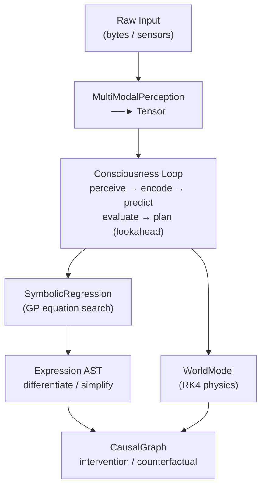
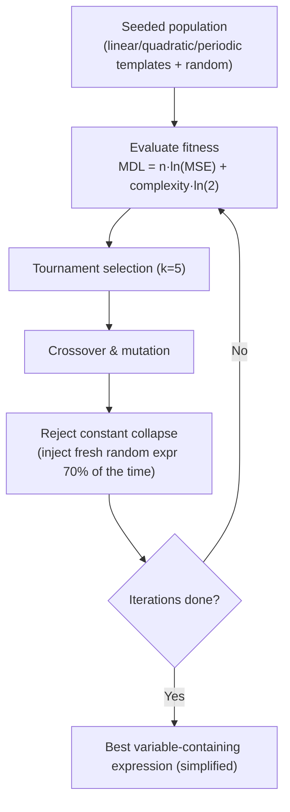
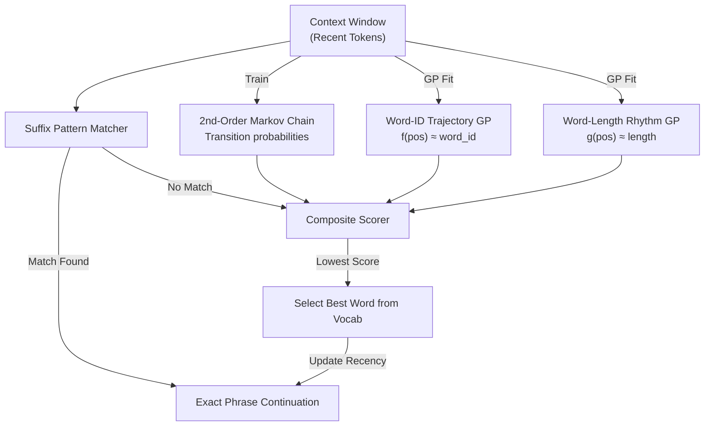
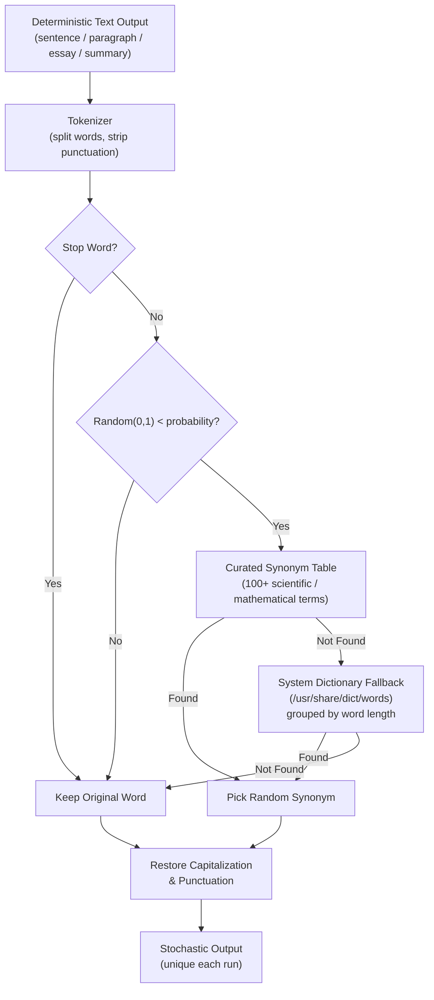
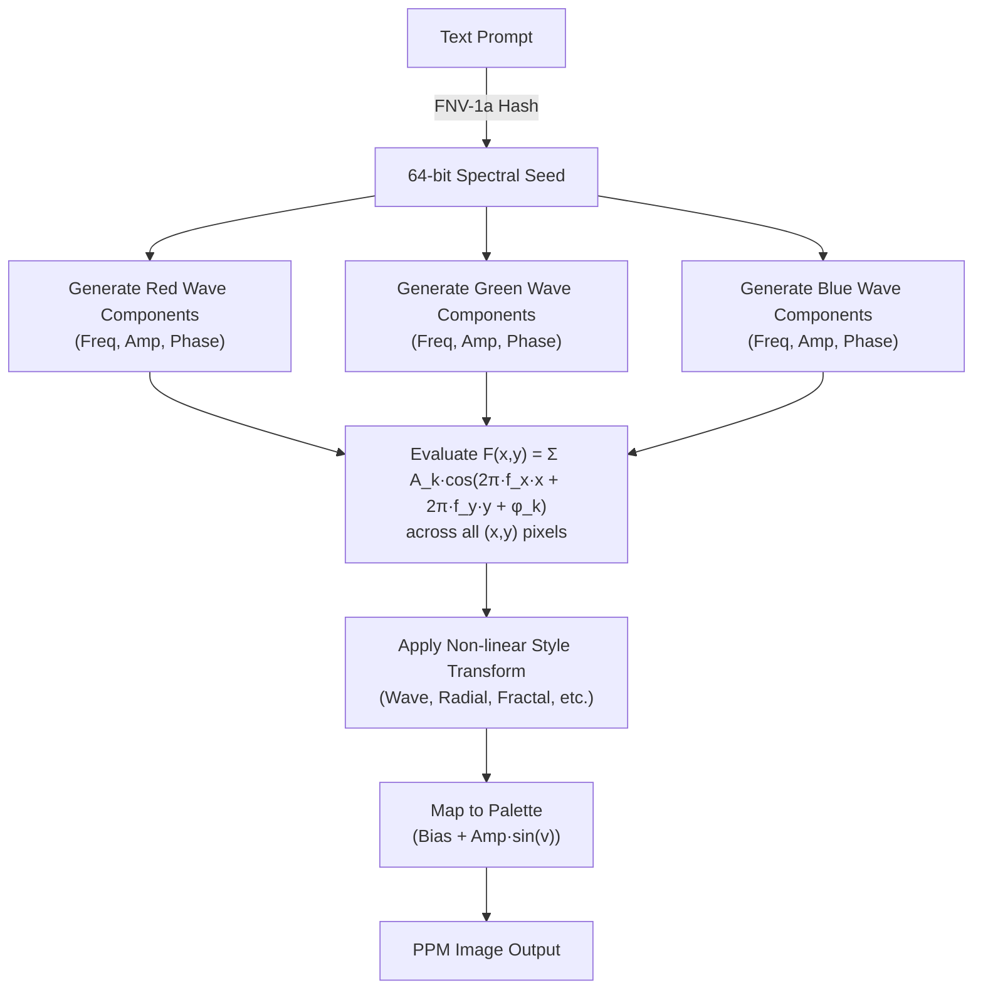

<div align="center">

# 👁️ LMM 🦀

[](https://wiseai.dev)

[](https://github.com/wiseaidotdev/lmm)
[](https://crates.io/crates/lmm)
[](https://pypi.org/project/lmm-rs/)
[](https://www.npmjs.com/package/@wiseaidev/lmm)
[](https://www.rust-lang.org/)
[](https://www.rust-lang.org)
[](LICENSE)
[](https://github.com/wiseaidev)

[](https://reddit.com/submit?url=https://github.com/wiseaidotdev/lmm&title=LMM%3A%20Large%20Mathematical%20Model%20%E2%80%94%20Encode%20Reality%20as%20Equations)
[](https://twitter.com/share?url=https://github.com/wiseaidotdev/lmm&text=LMM%3A%20Large%20Mathematical%20Model%20%E2%80%94%20Encode%20Reality%20as%20Equations)
[](https://www.linkedin.com/shareArticle?url=https://github.com/wiseaidotdev/lmm&title=LMM%3A%20Large%20Mathematical%20Model)

> **LMM** is a pure‑Rust framework that represents higher‑dimensional realities through symbolic mathematics and physics simulation, inspired by the Pharaonic model of intelligence: compress the world into durable, universal equations.

</div>

## 🎬 Demo

The following is a proof-of-concept demonstration of the predictive engine generating coherent English sentences. It is powered purely by deterministic mathematical equations and structural Subject-Verb-Object loops, utilizing the standard Linux system dictionary (`/usr/share/dict/words`) as its vocabulary fallback to function.

<video src="https://github.com/user-attachments/assets/f20ed16f-d90e-4983-bc47-0de2ce5c5a4f"></video>

This engine supports a complete suite of text-generation CLI commands, including `summarize`, `sentence`, `paragraph`, `essay`, and `ask` enabling sophisticated multi-paragraph construction driven entirely by mathematics.

<video src="https://github.com/user-attachments/assets/680d4ef4-bab1-47d4-84e8-86a11aa93294"></video>

<video src="https://github.com/user-attachments/assets/299c280d-dcf3-484f-bf02-c37836811dcb"></video>

<video src="https://github.com/user-attachments/assets/06ef5c15-7743-4d62-908f-52d22288de76"></video>

<video src="https://github.com/user-attachments/assets/3b4bba24-012b-487b-98c8-91e61336cead"></video>

<video src="https://github.com/user-attachments/assets/fc1d0adc-e2c3-421a-b6b6-4b21dcf3af06"></video>

## 🧠 Framework Overview

LMM bridges multimodal perception and actionable scientific discovery through five tightly integrated layers:

| Layer          | Modules                                       | Purpose                                                 |
| -------------- | --------------------------------------------- | ------------------------------------------------------- |
| **Perception** | `perception.rs`, `tensor.rs`                  | Raw bytes → normalised tensors                          |
| **Symbolic**   | `equation.rs`, `symbolic.rs`, `discovery.rs`  | GP symbolic regression, differentiation, simplification |
| **Physics**    | `physics.rs`, `simulation.rs`                 | ODE models + Euler / RK4 / RK45 / leapfrog integrators  |
| **Causal**     | `causal.rs`                                   | SCM graphs, do-calculus interventions, counterfactuals  |
| **Cognition**  | `consciousness.rs`, `world.rs`, `operator.rs` | Full perceive → encode → predict → act loop             |

### ⚙️ Architecture



### 🔬 Key Capabilities

- 🧬 **Genetic Programming**: real population-based symbolic regression that seeds templates (linear, quadratic, periodic) and enforces variable-containing equations.
- 📐 **Symbolic Calculus**: automatic differentiation (chain rule, product rule), constant folding simplification.
- 🌀 **Physics Suite**: Harmonic, Lorenz, Pendulum, SIR epidemic, N-body gravity: all implement `Simulatable`.
- 🔢 **Field Calculus**: N-D gradient, Laplacian, divergence, 3-D curl (central differences).
- 🔗 **Causal Reasoning**: structural causal models, `do(X=v)` interventions, counterfactual queries.
- 🧩 **Neural Operators**: circular convolution with SGD kernel learning, Fourier spectral operators.
- 🔤 **Text ↔ Equation**: encode any text into a symbolic equation; decode it back exactly (lossless via residuals).
- 🔮 **Symbolic Prediction**: LMM-native text continuation via sliding-window GP regression and vocabulary anchoring.
- 🎲 **Stochastic Enhancement**: synonym-bank word replacement (`--stochastic`) produces unique output every run while preserving mathematical sentence structure.

## 📦 Installation

### From Source

```sh
git clone https://github.com/wiseaidotdev/lmm
cd lmm
cargo build --release --all-features
```

The binary is at `./target/release/lmm`.

### Via Cargo

```sh
cargo install lmm --all-features
```

### Via NPM

```sh
npm install -g @wiseaidev/lmm
```

### Via Python

```sh
pip install lmm-rs
```

> [!NOTE]
> Requires Rust 1.86+. Install via [rustup](https://rustup.rs).

> [!TIP]
> To enable internet-aware commands (`ask`), install with the `net` feature:
>
> ```sh
> cargo install lmm --features cli,net
> # or
> cargo install lmm --all-features
> ```
>
> Or build from source: `cargo build --release --features cli,net`

## 🚀 CLI Usage

```sh
  ▄▄▄      ▄▄▄     ▄▄▄   ▄▄▄     ▄▄▄
 ▀██▀       ███▄ ▄███     ███▄ ▄███
  ██        ██ ▀█▀ ██     ██ ▀█▀ ██
  ██        ██     ██     ██     ██
  ██        ██     ██     ██     ██
 ████████ ▀██▀     ▀██▄ ▀██▀     ▀██▄

Large Mathematical Model · Equation-Based Intelligence

The `lmm` CLI enables interaction with the Large Mathematical Model (LMM).
It provides advanced equation discovery, physics simulation, causal
inference, and unified sequence processing features.

Usage: lmm <COMMAND>
Commands:
  simulate       Simulate continuous logical pathways
  discover       Discover governing equations from data
  consciousness  Evaluate conscious state coherence
  physics        Run harmonic and chaotic physical models
  causal         Perform causal interventions and counterfactuals
  field          Compute tensor field gradients and divergences
  encode         Encode continuous truth into discrete text
  decode         Decode text back into dynamic equations
  predict        Predict next sequence based on pattern logic
  summarize      Extract key meaning via GP scoring
  sentence       Generate a single structural sentence
  paragraph      Generate a cohesive paragraph from a seed
  essay          Structure a full essay with intro and conclusion
  ask            Ask a question and get an equation-scored answer from the web
  imagen         Generate an image from text via Spectral Field Synthesis
  help           Print this message or the help of the given subcommand(s)

Global Stochastic Flags (available on predict, summarize, sentence, paragraph, essay, ask):
  --stochastic                  Enable synonym-based randomization of output
  --probability      Replacement rate 0.0 - 1.0 (default: 0.5)

Options:
  -v, --verbose  Show detailed output with formatting
  -h, --help     Print help
  -V, --version  Print version
```

> [!TIP]
> By default, all commands cleanly output their raw generated results. Provide the `--verbose` (or `-v`) flag to display full interactive banners, seed information, and boxed separators!

## 📖 Subcommand Reference

### 1. `simulate`: Harmonic Oscillator

Runs a harmonic oscillator using the RK4 integrator.

```sh
lmm simulate --step 0.01 --steps 200
```

```sh
Simulated 200 steps with step_size=0.01
Final state: [-0.41614683639502004, -0.9092974268937748]
```

| Flag            | Default | Description                 |
| --------------- | ------- | --------------------------- |
| `-s`, `--step`  | `0.01`  | Integration step size (Δt)  |
| `-t`, `--steps` | `100`   | Number of integration steps |

### 2. `physics`: Physics Model Simulation

Simulate one of four built-in physics models.

```sh
# Lorenz chaotic attractor (σ=10, ρ=28, β=8/3)
lmm physics --model lorenz --steps 500 --step-size 0.01

# Nonlinear pendulum
lmm physics --model pendulum --steps 300 --step-size 0.005

# SIR epidemic model
lmm physics --model sir --steps 1000 --step-size 0.5

# Damped harmonic oscillator (default)
lmm physics --model harmonic --steps 200
```

**Lorenz example:**

```sh
Lorenz: 500 steps. Final xyz: [-8.900269690476492, -7.413716837503834, 29.311877708359006]
```

**SIR example:**

```sh
SIR: 1000 steps. Final [S,I,R]: [58.797367656865795, 7.649993277129408e-15, 941.2026323431321]
```

| Flag                | Default    | Description                                    |
| ------------------- | ---------- | ---------------------------------------------- |
| `-m`, `--model`     | `harmonic` | Model: `lorenz`, `pendulum`, `sir`, `harmonic` |
| `-s`, `--steps`     | `200`      | Number of integration steps                    |
| `-z`, `--step-size` | `0.01`     | Step size Δt                                   |

### 3. `discover`: Symbolic Regression

Runs Genetic Programming (GP) to discover a symbolic equation from data.

```sh
lmm discover --iterations 200
```

```sh
Discovered equation: (x + (1.002465056833142 + x))
```

The engine fits data points `(i*0.5, 2*i*0.5 + 1)` by default and finds the
underlying linear law. Increase `--iterations` for more complex datasets.

| Flag                 | Default     | Description                                      |
| -------------------- | ----------- | ------------------------------------------------ |
| `-d`, `--data-path`  | `synthetic` | Data source (`synthetic` = built-in linear data) |
| `-i`, `--iterations` | `100`       | Number of GP evolution iterations                |

### 4. `consciousness`: Perceive → Predict → Act Loop

Runs one tick of the full consciousness loop: raw bytes → perception tensor →
world model prediction → action plan.

```sh
lmm consciousness --lookahead 5
```

```sh
Consciousness ticked. New state: [0.0019607843137254832, -0.24901960784313726, -0.37450980392156863, 0.5]
Mean prediction error: 0
```

| Flag                | Default | Description                        |
| ------------------- | ------- | ---------------------------------- |
| `-l`, `--lookahead` | `3`     | Multi-step lookahead horizon depth |

### 5. `causal`: Causal Graph + do-Calculus

Builds a 3-node Structural Causal Model (`x → y → z`) and applies an
intervention `do(node = value)`, printing before/after values.

```sh
# Intervene on x: set x = 10, observe how y and z change
lmm causal --intervene-node x --intervene-value 10.0
```

```sh
Before intervention: x=Some(3.0), y=Some(6.0), z=Some(7.0)
After do(x=10): x=Some(10.0), y=Some(20.0), z=Some(21.0)
```

The SCM is:

- `y = 2 * x`
- `z = y + 1`

| Flag                      | Default | Description                            |
| ------------------------- | ------- | -------------------------------------- |
| `-n`, `--intervene-node`  | `x`     | Name of the node to intervene on       |
| `-v`, `--intervene-value` | `1.0`   | Value to set the node to (do-calculus) |

### 6. `field`: Scalar Field Calculus

Computes differential operators on a 1-D scalar field `f(i) = i²`.

```sh
# Gradient: should approach 2i (central differences)
lmm field --size 8 --operation gradient

# Laplacian: should be ≈ 2 everywhere (second derivative of x²)
lmm field --size 8 --operation laplacian
```

```sh
Gradient of x²: [1.0, 2.0, 4.0, 6.0, 8.0, 10.0, 12.0, 13.0]
```

```sh
Laplacian of x²: [0.0, 2.0, 2.0, 2.0, 2.0, 2.0, 2.0, 0.0]
```

| Flag                | Default    | Description                          |
| ------------------- | ---------- | ------------------------------------ |
| `-s`, `--size`      | `10`       | Number of field points               |
| `-o`, `--operation` | `gradient` | Operation: `gradient` or `laplacian` |

### 7. `encode`: Text → Symbolic Equation

This is the flagship demonstration of LMM's power. Any text is treated as a
sequence of byte values indexed by position. The GP engine discovers a symbolic
equation `f(x) ≈ byte[x]`. Integer residuals `(byte[x] - round(f(x)))` are
stored alongside the equation, guaranteeing **lossless round-trip recovery**.

```sh
lmm encode --text "The Pharaohs encoded reality in mathematics." \
           --iterations 150 --depth 5
```

```sh
╔══════════════════════════════════════════════════════╗
║  📐  Encode · GP Symbolic Compression                ║
╚══════════════════════════════════════════════════════╝

  📝 Input   : "The Pharaohs encoded reality in mathematics."
  📏 Length  : 44 chars

-- Equation ----------------------------------
  Equation: ((-12.541407707100985 * sin((-0.4 + ((x * x) * 0.8837323816189393)))) + 94.96615109151574)
Length: 44 chars
MSE: 530.1715
Max residual: 56

-- Encoded Data ------------------------------
  {"eq":"((-12.541407707100985 * sin((-0.4 + ((x * x) * 0.8837323816189393)))) + 94.96615109151574)","len":44,"mse":530.171549,"res":[-16,15,6,-51,-3,13,2,8,-3,27,9,17,-51,-6,15,-2,12,-1,5,-7,-51,16,7,13,9,0,22,28,-51,22,13,-56,11,10,19,22,18,15,5,12,8,13,23,-49]}

-- Round-trip Verify -------------------------
  ✅ PERFECT
  Decoded : "The Pharaohs encoded reality in mathematics."

  💾 To decode later:
     lmm decode --equation "((-12.541407707100985 * sin((-0.4 + ((x * x) * 0.8837323816189393)))) + 94.96615109151574)" --length 44 --residuals "-16,15,6,-51,-3,13,2,8,-3,27,9,17,-51,-6,15,-2,12,-1,5,-7,-51,16,7,13,9,0,22,28,-51,22,13,-56,11,10,19,22,18,15,5,12,8,13,23,-49"
```

> [!NOTE]
> GP is stochastic: the discovered equation and residual values will differ across runs. The round-trip recovery is always ✅ PERFECT because the integer residuals correct for any approximation error.

```sh
# Encode from a file
lmm encode --input ./my_message.txt --iterations 200 --depth 5
```

| Flag            | Default       | Description                                        |
| --------------- | ------------- | -------------------------------------------------- |
| `-i`, `--input` | `-`           | Path to a text file to encode (`-` = use `--text`) |
| `-t`, `--text`  | `Hello, LMM!` | Inline text (used when `--input` is `-`)           |
| `--iterations`  | `80`          | GP evolution iterations                            |
| `--depth`       | `4`           | Maximum expression tree depth                      |

### 8. `decode`: Symbolic Equation → Text

Reconstructs the original text from the equation and residuals printed by `encode`.

```sh
lmm decode \
  --equation "(95.09620435614187 - cos(x))" \
  --length 44 \
  --residuals "-10,9,5,-64,-16,9,3,20,2,15,8,20,-62,7,15,3,15,5,7,6,-63,18,5,1,13,11,22,26,-64,9,15,-62,15,2,20,8,6,15,3,21,9,3,20,-49"
```

```sh
╔══════════════════════════════════════════════════════╗
║  🔓  Decode · Equation to Text                       ║
╚══════════════════════════════════════════════════════╝

  📐 Equation : (95.09620435614187 - cos(x))
  📏 Length   : 44

-- Decoded Text ------------------------------
  The Pharaohs encoded reality in mathematics.
```

| Flag                | Required | Description                                                                 |
| ------------------- | -------- | --------------------------------------------------------------------------- |
| `-e`, `--equation`  | ✅       | Equation string (from `encode` output)                                      |
| `-l`, `--length`    | ✅       | Number of characters to recover                                             |
| `-r`, `--residuals` | ✅       | Comma-separated residuals. Use `--residuals="-3,1,..."` for negative values |

> [!IMPORTANT]
> Use `--residuals="-3,..."` (with `=`) or quote the argument when residuals contain negative values to prevent the shell from treating them as flags.

### 9. `predict`: Symbolic Text Continuation

The `predict` command acts as LMM's continuation engine. Unlike neural network LLMs that use massive statistical models, LMM strings together coherent English output using **Pure Mathematics**.

It does this by operating on three distinct, deterministic signals:

- **GP Trajectory Equation**: `f(pos) → word_byte_tone` (discovers long-range subject themes)
- **GP Rhythm Equation**: `g(pos) → word_length` (discovers alternating phonetic cadence)
- **Dictionary Grammar Engine**: Maps mathematical values to a curated pool of English nouns, verbs, adjectives with system dictionary fallback (`/usr/share/dict`), while flowing through cyclic Subject-Verb-Object (SVO) POS grammar loops.

```sh
lmm predict --text "Wise AI built the first LMM" --window 10 --predict-length 80
```

```text
╔══════════════════════════════════════════════════════╗
║  🔮  Predict · Symbolic Continuation                 ║
╚══════════════════════════════════════════════════════╝

  📚 Dictionary: 63746 words loaded
  📝 Input     : "Wise AI built the first LMM"
  🪟 Window    : 6 words
  📈 Trajectory: (x + 103.82300000000001)
  🎵 Rhythm    : (3.00402169780806 + sin(cos(cos(x))))

-- Continuation ------------------------------
  Wise AI built the first LMM in the true soul often long time and an open path of a solid scope is the human
```

> [!NOTE]
> Text is parsed completely via pure equations over a carefully constructed English vocabulary pool, mapping geometric relationships and POS states into elegant and mysterious sentences.

| Flag                     | Default                           | Description                                      |
| ------------------------ | --------------------------------- | ------------------------------------------------ |
| `-i`, `--input`          | `-`                               | Path to a text file (`-` = use `--text`)         |
| `-t`, `--text`           | `The Pharaohs encoded reality in` | Inline text seed                                 |
| `-w`, `--window`         | `32`                              | Context window in words                          |
| `-p`, `--predict-length` | `16`                              | Approximate character budget for continuation    |
| `--iterations`           | `80`                              | GP evolution iterations for the prediction model |
| `--depth`                | `4`                               | Maximum expression tree depth                    |
| `--stochastic`           | `false`                           | Enable synonym-based output randomization        |
| `--probability`          | `0.5`                             | Word replacement rate (0.0 = none, 1.0 = all)    |

### 10. `summarize`: Key Sentence Extraction

Summarize distills a large body of text down to its most mathematically significant sentences. It scores each sentence by tracking tone deviations, length variances, and relative position.

```sh
lmm summarize --text "The ancient Egyptians built the pyramids using advanced mathematical knowledge. Their understanding of geometry was extraordinary for the time. Modern engineers still struggle to replicate their precision. Mathematics was their sacred language of cosmic alignment." --sentences 2
```

```sh
╔══════════════════════════════════════════════════════╗
║  ✂️  Summarize · Key Sentence Extraction             ║
╚══════════════════════════════════════════════════════╝

  📝 Input : 264 chars
  📊 Extracting 2 key sentences via GP scoring...

-- Summary -----------------------------------
  1. The ancient Egyptians built the pyramids using advanced mathematical knowledge.
  2. Mathematics was their sacred language of cosmic alignment.
```

| Flag                | Default | Description                        |
| ------------------- | ------- | ---------------------------------- |
| `-t`, `--text`      | `...`   | Input text to summarize            |
| `-n`, `--sentences` | `2`     | Number of key sentences to extract |
| `--stochastic`      | `false` | Enable synonym-based randomization |
| `--probability`     | `0.5`   | Word replacement rate (0.0 - 1.0)  |

### 11. `sentence`: Single Sentence Generation

Generates a single, structurally elegant sentence. Add `--stochastic` to randomize word choices on each run - the mathematical structure stays fixed while synonyms vary.

```sh
lmm sentence --text "Mathematics is the language of the universe"

# With stochastic: different output every time
lmm sentence --text "Mathematics is the language of the universe" --stochastic
```

```sh
╔══════════════════════════════════════════════════════╗
║  ✍️  Sentence · Single Sentence Generation           ║
╚══════════════════════════════════════════════════════╝

  🌱 Seed : "Mathematics is the language of the universe"

-- Generated Sentence ------------------------
  Analysis enables the dynamic meaning of the universe.

# --stochastic run 1:
  Cognition enables the dynamic significance of the world.

# --stochastic run 2:
  Purplish facilitates the dynamic meaning of the world.
```

| Flag            | Default | Description                                       |
| --------------- | ------- | ------------------------------------------------- |
| `-t`, `--text`  | `...`   | Seed topic                                        |
| `--stochastic`  | `false` | Randomize word synonyms each run                  |
| `--probability` | `0.5`   | Fraction of eligible words to replace (0.0 - 1.0) |

### 12. `paragraph`: Cohesive Paragraph Generation

Chains multiple logically coherent sentences together, seeding subsequent sentence structures using extracted keywords from the original seed.

```sh
lmm paragraph --text "Equations reveal hidden truths about nature" --sentences 6
```

```sh
╔══════════════════════════════════════════════════════╗
║  📄  Paragraph · Generate a Paragraph                ║
╚══════════════════════════════════════════════════════╝

  🌱 Seed      : "Equations reveal hidden truths about nature"
  📊 Sentences : 6

-- Generated Paragraph -----------------------

  Simulation manifests the continuous symmetry of the truths. The symmetric wavelength connects infinity. Entropy remains the invariant truths underlying knowledge. The entropy of truths connects infinity. In essence, the symmetric integration encodes boundaries. Dimension describes precise reality beneath truths.
```

| Flag                | Default | Description                                       |
| ------------------- | ------- | ------------------------------------------------- |
| `-t`, `--text`      | `...`   | Seed topic for paragraph generation               |
| `-n`, `--sentences` | `4`     | Number of sentences in the paragraph              |
| `--stochastic`      | `false` | Randomize word synonyms each run                  |
| `--probability`     | `0.5`   | Fraction of eligible words to replace (0.0 - 1.0) |

### 13. `essay`: Full Essay Blueprint

Generates a fully structured essay, complete with an introduction, mathematical body paragraphs based on derived sub-topics, and a cohesive conclusion.

```sh
lmm essay --text 'Symmetry and the deeper patterns of physics' --paragraphs 2 --sentences 15
```

```sh
╔══════════════════════════════════════════════════════╗
║  📖  Essay · Generate a Full Essay                   ║
╚══════════════════════════════════════════════════════╝

  🌱 Topic      : "Symmetry and the deeper patterns of physics"
  📊 Paragraphs : 2 (15 sentences each)

-- Essay -------------------------------------

  ══════════════════════════════════════
  📖  Symmetry And The Deeper Patterns Of Physics
  ══════════════════════════════════════

-- Introduction ------------------------------

  Analysis illuminates the probabilistic motion of the truth. The deterministic probability reflects knowledge. Algebra holds the infinite truth of motion. The frequency of truth shapes chaos. At its core, the axiomatic probability transforms perception. Physics unveils bounded infinity beyond truth. Recursion connects the bounded balance of the truth. The dynamic wavelength unveils infinity. Wavelength remains the bounded truth through reality. The dimension of truth produces identity. At its core, the discrete frequency governs existence. Frequency produces invariant perception pervading truth. Structure unveils the invariant existence of the truth. The coherent integration produces existence. Integration remains the mathematical truth governing complexity.


-- Body · §1 ---------------------------------

  At its core, the discrete computation governs truth. Computation manifests invariant harmony pervading symmetry. Topology enables the invariant truth of the symmetry. The coherent transformation manifests change. Transformation remains the mathematical symmetry governing time. The physics of symmetry encodes order. In this framework, the continuous calculus generates nature. Geometry enables axiomatic space across symmetry. Gradient determines the axiomatic time of the symmetry. The structural divergence illuminates matter. Physics remains the probabilistic symmetry beneath meaning. The mathematics of symmetry expresses truth. At its core, the deterministic recursion captures matter. Entropy unveils abstract balance of symmetry. Divergence connects the abstract limits of the symmetry.


-- Body · §2 ---------------------------------

  The recursive transformation manifests energy. Transformation remains the continuous symmetry within limits. The calculus of symmetry enables meaning. At its core, the axiomatic analysis transforms knowledge. Gradient illuminates probabilistic motion inside symmetry. Pattern illuminates the probabilistic truth of the symmetry. The fundamental physics expresses matter. Physics remains the deterministic symmetry underlying harmony. The algebra of symmetry unveils energy. In this framework, the abstract recursion captures causality. Entropy describes bounded truth beyond symmetry. Divergence connects the bounded unity of the symmetry. The dynamic logic unveils truth. Resonance remains the bounded symmetry through knowledge. The entropy of symmetry produces knowledge.


-- Conclusion --------------------------------

  Gradient unveils the invariant limits of the symmetry. The invariant computation compresses balance. Divergence is the bounded symmetry of identity. The pattern of symmetry defines matter. Fundamentally, the continuous gradient generates truth. Logic determines axiomatic harmony across symmetry. Recursion determines the axiomatic infinity of the symmetry. The structural entropy illuminates infinity. Entropy are the probabilistic symmetry beneath space. The dimension of symmetry expresses reality. Moreover, the deterministic frequency defines existence. Frequency connects abstract perception of symmetry. Structure encodes the abstract chaos of the symmetry. The elegant integration encodes existence. Integration are the dynamic symmetry within meaning.
```

| Flag                 | Default | Description                                       |
| -------------------- | ------- | ------------------------------------------------- |
| `-t`, `--text`       | `...`   | Topic or title seed for the essay                 |
| `-n`, `--paragraphs` | `2`     | Number of body paragraphs to generate             |
| `-s`, `--sentences`  | `3`     | Number of sentences per paragraph                 |
| `--stochastic`       | `false` | Randomize word synonyms each run                  |
| `--probability`      | `0.5`   | Fraction of eligible words to replace (0.0 - 1.0) |

### 14. `ask`: Internet-Aware Knowledge Synthesis _(requires `net` feature)_

Searches the internet via DuckDuckGo Lite, aggregates the result snippets into a single text corpus, then applies the LMM's GP-scored equation engine to extract and compose the most mathematically significant sentences into a coherent response.

```sh
lmm ask --prompt "What is the Rust programming language?" --limit 5 --sentences 3
```

```sh
╔══════════════════════════════════════════════════════╗
║  🌐  Ask · Internet-Aware Knowledge Synthesis        ║
╚══════════════════════════════════════════════════════╝

  ❓ Prompt : "What is the Rust programming language?"

-- DuckDuckGo Results ------------------------
Rust (programming language)
Abstract: Rust is a general-purpose programming language. It is noted for its emphasis on performance, type safety, concurrency, and memory safety. Rust supports multiple programming paradigms. It was influenced by ideas from functional programming, including immutability, higher-order functions, algebraic data types, and pattern matching. It also supports object-oriented programming via structs, enums, traits, and methods. Rust is noted for enforcing memory safety without a conventional garbage collector; instead, memory safety errors and data races are prevented by the "borrow checker", which tracks the object lifetime of references at compile time. Software developer Graydon Hoare created Rust in 2006 while working at Mozilla, which officially sponsored the project in 2009. The first stable release, Rust 1.0, was published in May 2015.
Abstract Source: Wikipedia
Abstract URL: https://en.wikipedia.org/wiki/Rust_(programming_language)
Image URL: https://duckduckgo.com/i/832f249b21809a13.png
1. Rust (programming language) Category
URL: https://duckduckgo.com/c/Rust_(programming_language)?kp=%2D2
--------------------------------------------
2. History of programming languages - The history of programming languages spans from documentation of early mechanical computers to modern tools for software development. Early programming languages were highly specialized, relying on mathematical notation and similarly obscure syntax.
URL: https://duckduckgo.com/History_of_programming_languages?kp=%2D2
--------------------------------------------
3. Outline of the Rust programming language - The following outline is provided as an overview of and topical guide to Rust: Rust is a multi-paradigm programming language emphasizing performance, memory safety, and concurrency.
URL: https://duckduckgo.com/Outline_of_the_Rust_programming_language?kp=%2D2
--------------------------------------------
4. Pattern matching programming languages
URL: https://duckduckgo.com/c/Pattern_matching_programming_languages?kp=%2D2
--------------------------------------------
5. Multi-paradigm programming languages
URL: https://duckduckgo.com/c/Multi-paradigm_programming_languages?kp=%2D2
--------------------------------------------


-- LMM Response ------------------------------
  Rust is a general-purpose programming language.
  Rust supports multiple programming paradigms.
  Outline of the Rust programming language - The following outline is provided as an overview of and topical guide to Rust: Rust is a multi-paradigm programming language emphasizing performance, memory safety, and concurrency.
```

> [!NOTE]
> The `ask` command requires building with `--features cli,net`. No API key is needed.

| Flag                | Default  | Description                                       |
| ------------------- | -------- | ------------------------------------------------- |
| `-p`, `--prompt`    | required | The question or search query                      |
| `-l`, `--limit`     | `5`      | Maximum number of search results to fetch         |
| `-n`, `--sentences` | `3`      | Number of key sentences to extract                |
| `--region`          | `wt-wt`  | DuckDuckGo region code (e.g. `us-en`, `uk-en`)    |
| `--iterations`      | `40`     | GP scoring iterations                             |
| `--depth`           | `3`      | Maximum GP expression depth                       |
| `--stochastic`      | `false`  | Randomize word synonyms in the answer             |
| `--probability`     | `0.5`    | Fraction of eligible words to replace (0.0 - 1.0) |

### 15. `imagen`: Spectral Field Synthesis Image Generation

Generates an image from text based on Spectral Field Synthesis. It hashes the prompt to derive pure mathematical wave components, applies non-linear styles, and maps amplitudes to RGB.

```sh
lmm imagen --prompt "The ancient Egyptians built the pyramids with mathematical precision" \
           --width 512 --height 512 --style plasma --palette warm --components 12 --output ./egypt.ppm
```

```sh
╔══════════════════════════════════════════════════════╗
║  🎨  Imagen · Spectral Field Synthesis               ║
╚══════════════════════════════════════════════════════╝

  🖼  Prompt    : "The ancient Egyptians built the pyramids with mathematical precision"
  📐 Dimensions : 512x512
  🎭 Style      : plasma
  🎨 Palette    : warm
  🌊 Components : 12


-- Rendering ---------------------------------
  ✅ Saved to: ./egypt.ppm
```

| Flag                 | Default      | Description                                                         |
| -------------------- | ------------ | ------------------------------------------------------------------- |
| `-p`, `--prompt`     | required     | The text prompt to hash into the spectral seed                      |
| `--width`            | `512`        | Image width in pixels                                               |
| `--height`           | `512`        | Image height in pixels                                              |
| `-c`, `--components` | `8`          | Number of cosine wave components per channel                        |
| `-s`, `--style`      | `plasma`     | Transform: `wave`, `radial`, `orbital`, `fractal`, `flow`, `plasma` |
| `--palette`          | `auto`       | Color palette: `warm`, `cool`, `neon`, `mono`, `auto`               |
| `-o`, `--output`     | `output.ppm` | Output file path or directory (auto-names if dir)                   |

## 🔬 Architecture Deep Dive

### Genetic Programming Symbolic Regression



### Multi-Signal Prediction Engine



### Stochastic Synonym Enhancement

When `--stochastic` is enabled, the deterministic output is piped through the `StochasticEnhancer` layer, which draws from two synonym sources:



### Spectral Field Synthesis Image Generation



### RK45 Adaptive Integrator

All Butcher-tableau coefficients are named package-level constants:

```rust
const RK45_A41: f64 = 1932.0 / 2197.0;
const RK45_A42: f64 = -7200.0 / 2197.0;
const RK45_A43: f64 = 7296.0 / 2197.0;
const RK45_B5_1: f64 = 16.0 / 135.0;
// ... etc.
```

Step size is adapted each iteration using the error estimate:

```sh
h_new = 0.9 · h · (tol / error)^0.2
```

## 📰 Publications & Blog Posts

### Official Whitepaper

The architecture, formal mathematics, and paradigm behind the framework are fully documented in our official whitepaper.
**[Read the Whitepaper (PDF)](papers/lmm.pdf)**

### Blog Posts

- [LLMs are Usefull. LMMs will Break Reality](https://wiseai.dev/blogs/llms-are-usefull-lmms-will-break-reality): The original blog post that started this project.
- [Training Is An Evil Concept. LMMs Eliminates It Altogether](https://wiseai.dev/blogs/training-is-an-evil-concept-lmms-eliminates-it-altogether): Exploring the ethical, architectural, and data advantages of entirely training-free models.

## 📝 Citation

If you use LMM in your research, please cite our whitepaper:

```bibtex
@article{harmouch2026lmm,
  author  = {Mahmoud Harmouch},
  title   = {Mathematics Is All You Need: Training-Free Language Generation via
             Symbolic Regression and Stochastic Determinism},
  year    = {2026},
  url     = {https://github.com/wiseaidotdev/lmm}
}
```

## 🤝 Contributing

Contributions are welcome! Feel free to open issues or pull requests.

## 📝 License

This project is licensed under the MIT License: see the [LICENSE](LICENSE) file for details.
