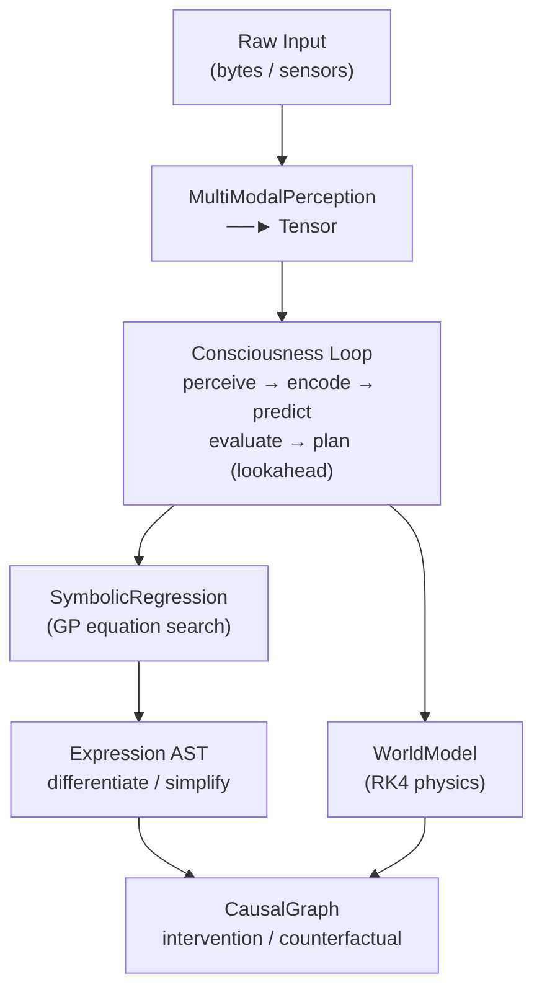
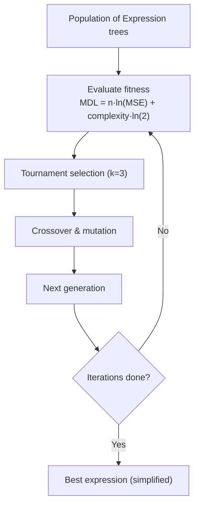

<div align="center">

# 👁️ LMM 🦀

[](https://wiseai.dev)

[](https://github.com/wiseaidotdev/lmm)
[](https://crates.io/crates/lmm)
[](https://www.rust-lang.org/)
[](https://www.rust-lang.org)
[](LICENSE)
[](https://github.com/wiseaidev)

[](https://reddit.com/submit?url=https://github.com/wiseaidotdev/lmm&title=LMM%3A%20Large%20Mathematical%20Model%20%E2%80%94%20Encode%20Reality%20as%20Equations)
[](https://twitter.com/share?url=https://github.com/wiseaidotdev/lmm&text=LMM%3A%20Large%20Mathematical%20Model%20%E2%80%94%20Encode%20Reality%20as%20Equations)
[](https://www.linkedin.com/shareArticle?url=https://github.com/wiseaidotdev/lmm&title=LMM%3A%20Large%20Mathematical%20Model)

> **LMM** is a pure‑Rust framework that represents higher‑dimensional realities through symbolic mathematics and physics simulation, inspired by the Pharaonic model of intelligence: compress the world into durable, universal equations.

</div>

## 🧠 Framework Overview

LMM bridges multimodal perception and actionable scientific discovery through five tightly integrated layers:

| Layer          | Modules                                       | Purpose                                                 |
| -------------- | --------------------------------------------- | ------------------------------------------------------- |
| **Perception** | `perception.rs`, `tensor.rs`                  | Raw bytes → normalised tensors                          |
| **Symbolic**   | `equation.rs`, `symbolic.rs`, `discovery.rs`  | GP symbolic regression, differentiation, simplification |
| **Physics**    | `physics.rs`, `simulation.rs`                 | ODE models + Euler / RK4 / RK45 / leapfrog integrators  |
| **Causal**     | `causal.rs`                                   | SCM graphs, do-calculus interventions, counterfactuals  |
| **Cognition**  | `consciousness.rs`, `world.rs`, `operator.rs` | Full perceive → encode → predict → act loop             |

### ⚙️ Architecture



### 🔬 Key Capabilities

- 🧬 **Genetic Programming**: real population-based symbolic regression that discovers equations from data.
- 📐 **Symbolic Calculus**: automatic differentiation (chain rule, product rule), constant folding simplification.
- 🌀 **Physics Suite**: Harmonic, Lorenz, Pendulum, SIR epidemic, N-body gravity: all implement `Simulatable`.
- 🔢 **Field Calculus**: N-D gradient, Laplacian, divergence, 3-D curl (central differences).
- 🔗 **Causal Reasoning**: structural causal models, `do(X=v)` interventions, counterfactual queries.
- 🧩 **Neural Operators**: circular convolution with SGD kernel learning, Fourier spectral operators.
- 🔤 **Text ↔ Equation**: encode any text into a symbolic equation; decode it back exactly (lossless via residuals).

## 📦 Installation

### From Source

```sh
git clone https://github.com/wiseaidotdev/lmm
cd lmm
cargo build --release
```

The binary is at `./target/release/lmm`.

### Via Cargo

```sh
cargo install lmm --all-features
```

> [!NOTE]
> Requires Rust 1.86+. Install via [rustup](https://rustup.rs).

## 🚀 CLI Usage

```sh
lmm <SUBCOMMAND> [OPTIONS]

Subcommands:
  simulate     Run a harmonic oscillator simulation
  physics      Run a named physics model (lorenz | pendulum | sir | harmonic)
  discover     Discover an equation from synthetic data using GP
  consciousness  Run a perceive→predict→act consciousness loop tick
  causal       Build a causal graph and apply do-calculus intervention
  field        Compute gradient or Laplacian of a scalar field
  encode       Encode text into a symbolic mathematical equation
  decode       Decode a symbolic equation back to text
```

## 📖 Subcommand Reference

### 1. `simulate`: Harmonic Oscillator

Runs a harmonic oscillator using the RK4 integrator.

```sh
lmm simulate --step 0.01 --steps 200
```

```sh
Simulated 200 steps with step_size=0.01
Final state: [-0.41614683639502004, -0.9092974268937748]
```

| Flag            | Default | Description                 |
| --------------- | ------- | --------------------------- |
| `-s`, `--step`  | `0.01`  | Integration step size (Δt)  |
| `-t`, `--steps` | `100`   | Number of integration steps |

### 2. `physics` — Physics Model Simulation

Simulate one of four built-in physics models.

```sh
# Lorenz chaotic attractor (σ=10, ρ=28, β=8/3)
lmm physics --model lorenz --steps 500 --step-size 0.01

# Nonlinear pendulum
lmm physics --model pendulum --steps 300 --step-size 0.005

# SIR epidemic model
lmm physics --model sir --steps 1000 --step-size 0.5

# Damped harmonic oscillator (default)
lmm physics --model harmonic --steps 200
```

**Lorenz example:**

```sh
Lorenz: 500 steps. Final xyz: [-8.900269690476492, -7.413716837503834, 29.311877708359006]
```

**SIR example:**

```sh
SIR: 1000 steps. Final [S,I,R]: [58.797367656865795, 7.649993277129408e-15, 941.2026323431321]
```

| Flag                | Default    | Description                                    |
| ------------------- | ---------- | ---------------------------------------------- |
| `-m`, `--model`     | `harmonic` | Model: `lorenz`, `pendulum`, `sir`, `harmonic` |
| `-s`, `--steps`     | `200`      | Number of integration steps                    |
| `-z`, `--step-size` | `0.01`     | Step size Δt                                   |

### 3. `discover`: Symbolic Regression

Runs Genetic Programming (GP) to discover a symbolic equation from data.

```sh
lmm discover --iterations 200
```

```sh
Discovered equation: (0.998899817974317 + (x + x))
```

The engine fits data points `(i*0.5, 2*i*0.5 + 1)` by default and finds the
underlying linear law. Increase `--iterations` for more complex datasets.

| Flag                 | Default     | Description                                      |
| -------------------- | ----------- | ------------------------------------------------ |
| `-d`, `--data-path`  | `synthetic` | Data source (`synthetic` = built-in linear data) |
| `-i`, `--iterations` | `100`       | Number of GP evolution iterations                |

### 4. `consciousness`: Perceive → Predict → Act Loop

Runs one tick of the full consciousness loop: raw bytes → perception tensor →
world model prediction → action plan.

```sh
lmm consciousness --lookahead 5
```

```sh
Consciousness ticked. New state: [0.0019607843137254832, -0.24901960784313726, -0.37450980392156863, 0.5]
Mean prediction error: 0
```

| Flag                | Default | Description                        |
| ------------------- | ------- | ---------------------------------- |
| `-l`, `--lookahead` | `3`     | Multi-step lookahead horizon depth |

### 5. `causal`: Causal Graph + do-Calculus

Builds a 3-node Structural Causal Model (`x → y → z`) and applies an
intervention `do(node = value)`, printing before/after values.

```sh
# Intervene on x: set x = 10, observe how y and z change
lmm causal --intervene-node x --intervene-value 10.0
```

```sh
Before intervention: x=Some(3.0), y=Some(6.0), z=Some(7.0)
After do(x=10): x=Some(10.0), y=Some(20.0), z=Some(21.0)
```

The SCM is:

- `y = 2 * x`
- `z = y + 1`

| Flag                      | Default | Description                            |
| ------------------------- | ------- | -------------------------------------- |
| `-n`, `--intervene-node`  | `x`     | Name of the node to intervene on       |
| `-v`, `--intervene-value` | `1.0`   | Value to set the node to (do-calculus) |

### 6. `field` — Scalar Field Calculus

Computes differential operators on a 1-D scalar field `f(i) = i²`.

```sh
# Gradient: should approach 2i (central differences)
lmm field --size 8 --operation gradient

# Laplacian: should be ≈ 2 everywhere (second derivative of x²)
lmm field --size 8 --operation laplacian
```

```sh
Gradient of x²: [1.0, 2.0, 4.0, 6.0, 8.0, 10.0, 12.0, 13.0]
```

```sh
Laplacian of x²: [0.0, 2.0, 2.0, 2.0, 2.0, 2.0, 2.0, 0.0]
```

| Flag                | Default    | Description                          |
| ------------------- | ---------- | ------------------------------------ |
| `-s`, `--size`      | `10`       | Number of field points               |
| `-o`, `--operation` | `gradient` | Operation: `gradient` or `laplacian` |

### 7. `encode`: Text → Symbolic Equation

This is the flagship demonstration of LMM's power. Any text is treated as a
sequence of byte values indexed by position. The GP engine discovers a symbolic
equation `f(x) ≈ byte[x]`. Integer residuals `(byte[x] − round(f(x)))` are
stored alongside the equation, guaranteeing **lossless round-trip recovery**.

```sh
# Encode an inline string
lmm encode --text "The Pharaohs encoded reality in mathematics." \
           --iterations 150 --depth 5
```

```sh
━━━ LMM ENCODER ━━━━━━━━━━━━━━━━━━━━━━━━━━━━━━━━━━
Input text  : "The Pharaohs encoded reality in mathematics."
Characters  : 44
Running GP symbolic regression (150 iterations, depth 5)…

Equation: 95.09083755315439
Length: 44 chars
MSE: 648.6736
Max residual: 63

━━━ ENCODED DATA ━━━━━━━━━━━━━━━━━━━━━━━━━━━━━━━━━
{"eq":"95.09083755315439","len":44,"mse":648.673554,"res":[-11,9,6,-63,-15,9,2,19,2,16,9,20,-63,6,15,4,16,5,6,5,-63,19,6,2,13,10,21,26,-63,10,15,-63,14,2,21,9,6,14,2,21,10,4,20,-49]}

━━━ VERIFY ROUND-TRIP ━━━━━━━━━━━━━━━━━━━━━━━━━━━━
Decoded text: "The Pharaohs encoded reality in mathematics."
Round-trip  : ✅ PERFECT

To decode later, run:
  lmm decode --equation "95.09083755315439" --length 44 --residuals "-11,9,6,-63,-15,9,2,19,2,16,9,20,-63,6,15,4,16,5,6,5,-63,19,6,2,13,10,21,26,-63,10,15,-63,14,2,21,9,6,14,2,21,10,4,20,-49"
```

```sh
# Encode from a file
lmm encode --input ./my_message.txt --iterations 200 --depth 5
```

| Flag            | Default       | Description                                        |
| --------------- | ------------- | -------------------------------------------------- |
| `-i`, `--input` | `-`           | Path to a text file to encode (`-` = use `--text`) |
| `-t`, `--text`  | `Hello, LMM!` | Inline text (used when `--input` is `-`)           |
| `--iterations`  | `80`          | GP evolution iterations                            |
| `--depth`       | `4`           | Maximum expression tree depth                      |

### 8. `decode`: Symbolic Equation → Text

Reconstructs the original text from the equation and residuals printed by `encode`.

```sh
lmm decode \
  --equation "95.09060040474505" \
  --length 44 \
  --residuals="-11,9,6,-63,-15,9,2,19,2,16,9,20,-63,6,15,4,16,5,6,5,-63,19,6,2,13,10,21,26,-63,10,15,-63,14,2,21,9,6,14,2,21,10,4,20,-49"
```

```sh
━━━ LMM DECODER ━━━━━━━━━━━━━━━━━━━━━━━━━━━━━━━━━━
Equation : 95.09060040474505
Length   : 44

━━━ DECODED TEXT ━━━━━━━━━━━━━━━━━━━━━━━━━━━━━━━━━
The Pharaohs encoded reality in mathematics.
```

| Flag                | Required | Description                                                                 |
| ------------------- | -------- | --------------------------------------------------------------------------- |
| `-e`, `--equation`  | ✅       | Equation string (from `encode` output)                                      |
| `-l`, `--length`    | ✅       | Number of characters to recover                                             |
| `-r`, `--residuals` | ❌       | Comma-separated residuals. Use `--residuals="-3,1,..."` for negative values |

> [!IMPORTANT]
> Use `--residuals="-3,..."` (with `=`) or quote the argument when residuals contain negative values to prevent the shell from treating them as flags.

## 🔬 Architecture Deep Dive

### Genetic Programming Symbolic Regression



### RK45 Adaptive Integrator

All Butcher-tableau coefficients are named package-level constants:

```rust
const RK45_A41: f64 = 1932.0 / 2197.0;
const RK45_A42: f64 = -7200.0 / 2197.0;
const RK45_A43: f64 = 7296.0 / 2197.0;
const RK45_B5_1: f64 = 16.0 / 135.0;
// ... etc.
```

Step size is adapted each iteration using the error estimate:

```sh
h_new = 0.9 · h · (tol / error)^0.2
```

## 📰 Whitepaper

[LLMs are Usefull. LMMs will Break Reality](https://wiseai.dev/blogs/llms-are-usefull-lmms-will-break-reality): the blog post that started this project.

## 🤝 Contributing

Contributions are welcome! Feel free to open issues or pull requests.

## 📝 License

This project is licensed under the MIT License: see the [LICENSE](LICENSE) file for details.
