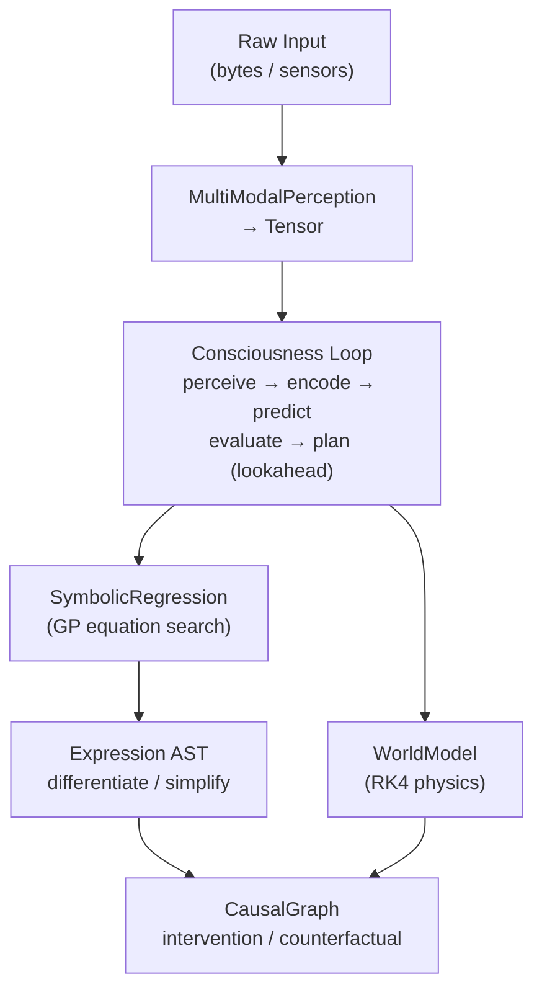

# LMM Rust Documentation 🦀

The `lmm` library is a pure-Rust symbolic intelligence framework available on [crates.io](https://crates.io/crates/lmm). It requires **Rust 1.86+** and exposes the full engine as a library crate with no mandatory runtime dependencies.

## 📦 Installation

Add this to your `Cargo.toml`:

```toml
[dependencies]
lmm = "0.1.15"
```

### Cargo Features

| Feature       | Description                                          |
| ------------- | ---------------------------------------------------- |
| `rust-binary` | Enables the standalone `lmm` terminal CLI executable |
| `cli`         | Core CLI scaffolding (subset of `rust-binary`)       |
| `net`         | Internet-aware `ask` command via DuckDuckGo Lite     |
| `python`      | Python extension module (pyo3 / maturin)             |
| `node`        | Node.js native add-on (napi-derive)                  |

Enable all features for a fully featured local build:

```sh
cargo build --release --all-features
```

## 📚 Library Usage

### Tensor arithmetic

```rust
use lmm::prelude::*;

let t = Tensor::new(vec![2, 3], vec![1.0, 2.0, 3.0, 4.0, 5.0, 6.0]).unwrap();
println!("{}", t.norm());
```

### Symbolic expressions

```rust
use lmm::equation::Expression;
use std::collections::HashMap;

let expr: Expression = "(sin(x) * 2)".parse().unwrap();
let mut vars = HashMap::new();
vars.insert("x".to_string(), std::f64::consts::PI);
println!("{}", expr.evaluate(&vars).unwrap()); // ≈ 0

let deriv = expr.symbolic_diff("x").simplify();
println!("{}", deriv); // (cos(x) * 2)
```

### Causal graph + do-calculus

```rust
use lmm::causal::CausalGraph;

let mut g = CausalGraph::new();
g.add_node("x", Some(3.0));
g.add_node("y", None);
g.add_edge("x", "y", Some(2.0)).unwrap();
g.forward_pass().unwrap();

let y_cf = g.counterfactual("x", 10.0, "y").unwrap();
println!("do(x=10) → y = {y_cf}"); // 20.0
```

### Physics simulation

```rust
use lmm::prelude::*;

let osc = HarmonicOscillator::new(1.0, 1.0, 0.0).unwrap();
let sim = Simulator { step_size: 0.01 };
let state = sim.rk4_step(&osc, osc.state()).unwrap();
println!("{:?}", state.data);
```

### Text → Symbolic equation (lossless round-trip)

```rust
use lmm::encode::{encode_text, decode_message};

let enc = encode_text("The Pharaohs encoded reality.", 80, 4).unwrap();
let recovered = decode_message(&enc).unwrap();
assert_eq!(recovered, "The Pharaohs encoded reality.");
```

### Symbolic text continuation

```rust
use lmm::predict::TextPredictor;

let predictor = TextPredictor::new(20, 40, 3);
let result = predictor.predict_continuation("Wise AI built the first LMM", 80).unwrap();
println!("{}", result.continuation);
```

### Genetic programming symbolic regression

```rust
use lmm::prelude::*;

let mut sr = SymbolicRegression::new(3, 100);
let inputs: Vec<Vec<f64>> = (0..10).map(|i| vec![i as f64 * 0.5]).collect();
let targets: Vec<f64> = (0..10).map(|i| 2.0 * i as f64 * 0.5 + 1.0).collect();
let eq = sr.fit(&inputs, &targets).unwrap();
println!("Discovered: {eq}");
```

### Consciousness loop

```rust
use lmm::prelude::*;

let state = Tensor::zeros(vec![4]);
let mut brain = Consciousness::new(state, 3, 0.01);
let new_state = brain.tick(b"The Pharaohs built the pyramids").unwrap();
println!("{:?}", new_state);
```

### Spectral image generation

```rust,no_run
use lmm::prelude::*;

let params = ImagenParams {
    prompt: "ancient egypt mathematics".into(),
    width: 512, height: 512, components: 8,
    style: StyleMode::Plasma,
    palette_name: "warm".into(),
    output: "egypt.ppm".into(),
};
let path = render(&params).unwrap();
println!("Saved to {path}");
```

## 🏗️ Architecture



## 📖 Core Types Reference

| Type / Function                                                   | Description                                                                    |
| ----------------------------------------------------------------- | ------------------------------------------------------------------------------ |
| `Tensor::new(shape, data)`                                        | N-D row-major f64 tensor; `.norm()`, `.scale()`, `.add()`, `.dot()`            |
| `Expression` (impl `FromStr`)                                     | Symbolic AST; `.evaluate()`, `.symbolic_diff()`, `.simplify()`, `Display`      |
| `CausalGraph`                                                     | SCM with `add_node`, `add_edge`, `forward_pass`, `intervene`, `counterfactual` |
| `HarmonicOscillator`, `LorenzSystem`, `Pendulum`, `SIRModel`      | Physics models; all implement `Simulatable`                                    |
| `Simulator`                                                       | `.euler_step_osc()`, `.rk4_step_osc()`, `.rk45_adaptive()`                     |
| `SymbolicRegression`                                              | GP regressor; `.fit(inputs, targets) → String`                                 |
| `TextPredictor`                                                   | `.predict_continuation(text, length) → PredictionResult`                       |
| `SentenceGenerator`                                               | `.generate(seed) → String`                                                     |
| `ParagraphGenerator`                                              | `.generate(seed) → String`                                                     |
| `TextSummarizer`                                                  | `.summarize(text) → String`                                                    |
| `StochasticEnhancer`                                              | `.enhance(text) → String`                                                      |
| `Consciousness`                                                   | `.tick(bytes) → Vec<f64>`                                                      |
| `encode_text(text, iters, depth)`                                 | Returns `EncodedText { expression, length, residuals }`                        |
| `decode_message(expr, length, residuals)`                         | Losslessly reconstructs original text                                          |
| `mdl_score`, `compute_mse`, `r_squared`, `aic_score`, `bic_score` | Model-fit metrics                                                              |
| `render_image(prompt, w, h, style, palette, n, out)`              | Spectral field synthesis → PPM file                                            |

## 📄 License

Licensed under the [MIT License](LICENSE).
