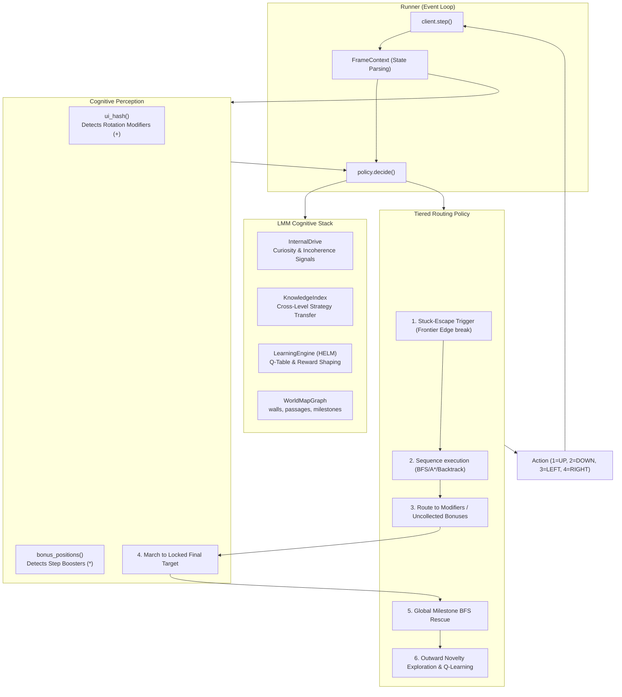

<div align="center">

# 🕹️ arc-lmm-agent

[](https://arcprize.org/replay/8471c865-4c54-40c5-a523-dcaa681aa4f1)
[](../../LICENSE)

[](https://arcprize.org/replay/8471c865-4c54-40c5-a523-dcaa681aa4f1)

> `arc-lmm-agent` is an autonomous navigation solver for ARC-AGI interactive environments (`ls20` game atm). It uses an episodic framework, progressive strategy learning, and robust world modeling to dynamically maneuver through complex grids, interact with rotation modifiers, systematically collect step-boosters, and reach the target zones across escalating levels.

</div>

## 🤔 Core Challenges Solved

The `ls20` environment is an intricate, partially observable continuous-exploration puzzle requiring multiple stages of logical sequential progression within constrained action budgets:

1. **Fog of War**: The grid is only discovered as the agent moves. False walls and passages must be robustly classified.
1. **Sequential Configuration Objectives**: The final target zone cannot be successfully entered until the agent's avatar matches the exact expected rotation scheme and shape footprint. This is achieved by first locating and interacting with isolated `+` rotation modifiers, then deliberately combining step boosters to formulate the right geometric structure.
1. **Budget Exhaustion**: Random walks immediately fail. The agent must memorize prior paths, actively backtrack through explored terrain, and utilize A* routing where possible to minimize wasted step limits.

## 👷🏻‍♀️ Agent Architecture

`arc-lmm-agent` overcomes these constraints by bridging standard graph theory with the deeper `lmm-agent` cognitive stack (Motivation drives, Semantic Knowledge Index, tabular Q-Learning).



## 🧠 Generalized Tiered Navigation

The agent employs a pure routing dispatcher (`LmmPolicy::decide()`). At each step, it drops through a prioritized list of strategies, taking the first valid action it finds:

### 1. Stuck-Escape Protocol
If the agent detects heavy oscillation (re-visiting the same grid coordinates repeatedly without discovering new terrain), it bypasses naive A* and fires a BFS to target the nearest globally un-visited grid coordinate or frontier edge, effectively "breaking" local optima loops.

### 2. Strategic Routing (Modifiers -> Boosters -> Target)
The agent inherently learns an ordered priority sequence based on what it perceives in the current grid:
- **Modifier Discovery**: Before anything else, the agent seeks out the `+` modifier.
- **Boosters/Treats Collection**: If the modifier has been activated, the agent immediately pivot to acquiring any known step-boosters (yellow treats). 
- **Backtracking**: The agent employs a tactical backtracking queue. After picking up a booster, the agent *reverses the path it took from the modifier*, ensuring it safely retraces known, cleared passageways rather than risking new dead-ends. When necessary, it intentionally crosses the modifier a second time to configure the target shape.
- **Final Assault**: Once all visible bonuses are collected, the agent locks onto target coordinates and deploys a ruthless march straight into the goal.

### 3. Progressive BFS & Milestone Memories 
Every time the agent identifies a modifier or starts a new level, it marks the exact state hash as a **Milestone**. If the agent is entirely lost, it can drop into a rescue fallback that BFS routes directly to these known milestones across the entire level `WorldMap`.

### 4. Novelty Exploration
When all else fails (no plan, no known targets, nothing visible on radar), the agent relies on raw exploration:
- Sorts neighbors by how many times they have been globally visited.
- Seeks out absolute "novel" states.
- Applies a fallback to the `LearningEngine` (Q-Table recommendation) to guess the most historically profitable direction based on reinforcement gradients.

## 🛠 `lmm-agent` Core Integrations

The solver natively utilizes the overarching `lmm-agent` architecture for generalized intelligence logic:

1. **`InternalDrive`**: The agent fires intrinsic reward/motivation signals. If the agent finds a new bonus position or discovers a completely unvisited tile, the `Curiosity` drive spikes. If the agent bumps into a newly discovered wall and loses a turn, the `Incoherence` drive registers the penalty, adjusting future behavioral tolerances.
2. **`KnowledgeIndex` (Cross-Level Transfer)**: As the agent completes `Level N`, it synthesizes the trial's metadata into narrative English (e.g. *"Level 0 completed after 1 mod interactions and 0 bonuses... "*). This raw text is dynamically ingested into the localized `KnowledgeIndex`. When `Level N+1` begins, this long-term semantic memory primes the agent about the nature of the puzzles it will likely encounter.
3. **`LearningEngine` (HELM)**: Traditional tabular Q-learning shapes underlying values. The agent emits a continuous localized Bellman reward stream (+10 for activating a modifier, +50 for moving closer to the target post-modifier, -1.0 for wall collisions) to fine-tune the `NOVELTY` fallback recommendations.


## 🕹️ Run the agent

```sh
cargo run --release -- --base-url "https://three.arcprize.org" --api-key "your-api-key"
```
