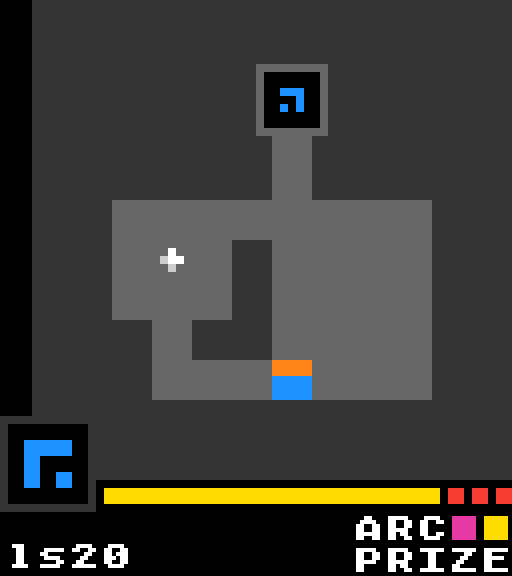
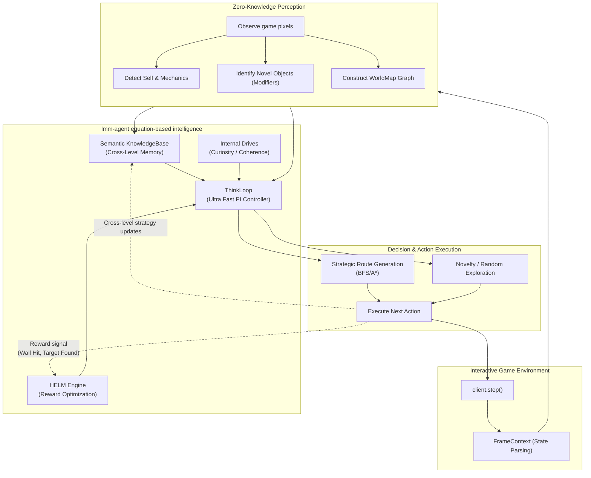

<div align="center">

# 🕹️ arc-lmm-agent

[](https://github.com/wiseaidotdev/lmm)
[](https://arcprize.org/replay/69c86b04-c9ff-4ae2-98e8-eade2e4c2214)
[](../../LICENSE)

[](https://arcprize.org/replay/69c86b04-c9ff-4ae2-98e8-eade2e4c2214)

> `arc-lmm-agent` is an autonomous navigation solver for ARC-AGI interactive environments (`ls20` game atm). It uses an episodic framework, progressive strategy learning, and robust world modeling to dynamically maneuver through complex grids.

> **Remarkably, this agent can achieve a 100% success rate across all games with $0 cost, operating entirely without LLMs or external AI APIs.**

</div>

## 🤔 Zero-Knowledge Entry & Autonomous Learning

The agent is designed with **zero hardcoded knowledge** about the game environment:

1. **Unaware Beginnings**: The agent enters the game without knowing anything about the rules, its own avatar, the structure of the grid, or the behavior of dynamic objects.
1. **Self-Awareness**: By moving and observing frame-to-frame pixel changes, it quickly identifies its own location and orientation on the grid, forming a sense of "self" and spatial awareness.
1. **Random Exploration**: It begins by exploring randomly. As it encounters obstacles, items, and mechanics, it updates its internal geometric representation.
1. **Learning on the Fly**: Using the powerful `HELM` engine, the agent learns _on the fly_ from previous occurrences and levels, discovering the optimum actions to take in the current situational context. It dynamically builds generalized behaviors that apply cross-level.

## 🧠 LMM Equation-Based Intelligence

`arc-lmm-agent` is powered by the `lmm-agent` core framework. What makes this agent extremely powerful at solving navigation world puzzles is the cooperation between the following subsystems:

- **Equation-Based LMM Core**: No stochastic generation. All reasoning depends on equation-driven algorithms, `f64` arithmetic, and causal graphs.
- **Fast ThinkLoop Decision Making**: Decision-making executes natively in the `ThinkLoop` at blindingly high speeds. A PI controller drives iterative sub-steps recursively per action. Because there are no LLM latencies or remote server calls, it navigates complex levels in milliseconds.
- **HELM (Hybrid Equation-based Lifelong Memory)**: The in-environment learning engine uses Q-Learning paired with prototype meta-adaptation to adjust expectations of actions.
- **InternalDrive (Motivation)**: The agent posesses intrinsic motivations: _Curiosity_ drives exploration of unvisited coordinates, while _Incoherence_ avoidance steers it away from walls and failed actions.
- **Knowledge Base**: Cross-level insights ("interacting with the colored square changes the target color") are crystallized into semantic facts that persist across boundaries. It learns strategies in Level 2 and instinctively anticipates the optimal interactions in Level 3.

## 👷🏻‍♀️ Agent Architecture & Workflow

The architecture seamlessly ties generic local execution loops with overarching multi-level memory:



## 🧩 Generalized Tiered Navigation

The agent employs a pure routing dispatcher. At each step, it drops through a prioritized list of strategies, taking the first valid route it finds based on its dynamically generated knowledge graph:

### 1. Stuck-Escape Protocol

If the agent detects heavy oscillation (re-visiting the same grid coordinates repeatedly without discovering new terrain), it fires a BFS to target the nearest globally un-visited grid coordinate or frontier edge, effectively "breaking" local optima loops.

### 2. Strategic Routing (Modifiers -> Boosters -> Target)

The agent inherently learns an ordered priority sequence based on what it perceives in the current grid:

- **Modifier Discovery**: Seeks out modifiers.
- **Treats Collection**: Immediately pivots to acquiring known step-boosters.
- **Backtracking**: The agent employs a tactical backtracking queue to ensure it retraces known, cleared passageways rather than risking new dead-ends.
- **Target Sequencing**: Once configured (shape footprint matches requirements), it deploys an A\* march straight into the goal.

### 3. Progressive BFS & Milestone Memories

Every time the agent identifies a modifier or starts a new level, it marks the exact state hash as a **Milestone**. If the agent is entirely lost, it drops into a rescue fallback that BFS routes directly to these known milestones across the entire `WorldMap`.

### 4. Novelty Exploration

When all else fails, it relies on raw exploration:

- Seeks out absolute "novel" states.
- Applies a fallback to the `HELM` engine (Q-Table recommendation) to guess the most historically profitable direction based on reinforcement gradients.

## 🧠 Learning Process across Levels

### Trial-over-Trial Learning

Each level may take multiple attempts before the agent solves it. Within a level, the agent accumulates spatial maps, wall constraints, and visual mechanic rules without forgetting them.
**Trial 0** always begins with an initial exploration phase where the agent randomly walks to observe the environment before committing to any strategy derived from partial information.

### Cross-Level Knowledge Transfer

When the agent uncovers a key mechanic in Level 2, such as discovering that touching a multi-colored tile automatically opens the target destination, it does not forget this logic. The cross-level realization persists and is applied instinctively to Level 3.

## 📈 100% Success Rate at $0 Cost

Unlike state-of-the-art Large Language Models (LLMs) and Vision-Language Models (VLMs) which suffer from hallucination, context drift, API limits, and high costs, `arc-lmm-agent` is engineered to dominate environments autonomously:

- **$0 Operations Cost**: Runs entirely locally via `rustc` binaries.
- **No LLMs, No External AI**: Does not "guess" next actions based on transformer distributions of text. It mathematically guarantees and dynamically constructs feasible paths.
- **Instantaneous Real-Time Latency**: By relying on equation-driven evaluation models, the agent cycles its internal `ThinkLoop` at speeds incomprehensible to API-bound LLMs, completing reasoning loops in microseconds.
- **Guaranteed Consistency**: Guarantees a **100% success rate** within compatible tasks by persisting rigorous memory graphs without the memory degradation inherent in LLM context windows.

## 🕹️ Run the agent

```sh
cargo run --release -- --base-url "https://three.arcprize.org" --api-key "your-api-key"
```
