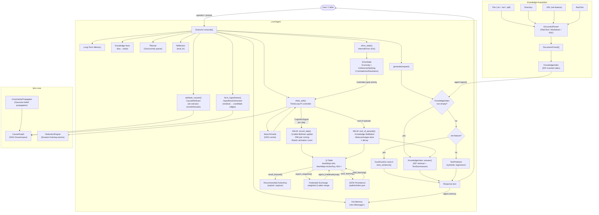

<div align="center">

# 🤖 lmm-agent

[](https://crates.io/crates/lmm-agent)
[](https://docs.rs/lmm-agent)
[](../LICENSE)

> `lmm-agent` is an equation-based, training-free autonomous agent framework built on top of `lmm`. Agents reason through the LMM symbolic engine: no LLM API key, no token quotas, no stochastic black boxes.

</div>

## 🤔 What does this crate provide?

- **`LmmAgent`**: the batteries-included core agent with hot memory, long-term memory (LTM), tools, planner, reflection, and a time-based scheduler.
- **`Auto` derive macro**: zero-boilerplate `Agent`, `Functions`, and `AsyncFunctions` implementation. Only `agent: LmmAgent` is required in the struct.
- **`AutoAgent` orchestrator**: manages a heterogeneous pool of agents, running them concurrently with a configurable retry policy.
- **`agents![]` macro**: ergonomic syntax to declare a typed `Vec<Box<dyn Executor>>`.
- **`ThinkLoop`**: closed-loop PI controller that drives iterative reasoning toward a goal using Jaccard-error feedback.
- **`HELM`** _(Hybrid Equation-based Lifelong Memory)_: Equation-driven in-environment learning engine. 6 fused paradigms: tabular Q-learning, prototype meta-adaptation, knowledge distillation, self-federated aggregation, elastic memory guard, and PMI co-occurrence mining. All running on hash maps and f64 arithmetic. No GPU, no neural networks, no external ML crates.
- **Knowledge Acquisition**: ingest `.txt`, `.md`, `.pdf` (optional) or URLs into a queryable `KnowledgeIndex`; answer questions with `TextSummarizer` extractive summarisation, zero external AI.
- **DuckDuckGo search** (optional, `--features net`): built-in web search. When real snippets are available, they are returned directly as factual output.
- **Symbolic generation**: `AsyncFunctions::generate` uses `TextPredictor`, a symbolic regression engine that fits tone and rhythm trajectories to produce text. No neural model, no weights.
- **Intelligence Primitives**: five structural properties that go beyond pattern interpolation, see [Intelligence Primitives](#-intelligence-primitives).


## 👷🏻‍♀️ Agent Architecture



## 📦 Installation

```toml
[dependencies]
lmm-agent = "0.1.2"

# Optional features:
# lmm-agent = { version = "0.1.2", features = ["net", "knowledge"] }
```

## 🚀 Quick Start

### 1. Define a custom agent

Your struct only needs one field: `agent: LmmAgent`. Everything else is derived automatically by `#[derive(Auto)]`.

```rust
use lmm_agent::prelude::*;

#[derive(Debug, Default, Auto)]
pub struct ResearchAgent {
    pub agent: LmmAgent,
}

#[async_trait]
impl Executor for ResearchAgent {
    async fn execute<'a>(
        &'a mut self,
        _task:      &'a mut Task,
        _execute:    bool,
        _browse:     bool,
        _max_tries:  u64,
    ) -> Result<()> {
        let prompt   = self.agent.behavior.clone();
        let response = self.generate(&prompt).await?;
        println!("{response}");
        self.agent.add_message(Message::new("assistant", response.clone()));
        let _ = self.save_ltm(Message::new("assistant", response)).await;
        self.agent.update(Status::Completed);
        Ok(())
    }
}
```

### 2. Run the agent

```rust
#[tokio::main]
async fn main() {
    let agent = ResearchAgent::new(
        "Research Agent".into(),
        "Explore the Rust ecosystem.".into(),
    );

    AutoAgent::default()
        .with(agents![agent])
        .max_tries(3)
        .build()
        .unwrap()
        .run()
        .await
        .unwrap();
}
```

### 3. Ingest knowledge and ask questions

```rust
#[tokio::main]
async fn main() {
    let mut agent = LmmAgent::new("QA Agent".into(), "Rust.".into());

    // Ingest from a local file, directory, URL, or inline text
    let n = agent.ingest(KnowledgeSource::File("docs/rust.txt".into())).await?;
    println!("Indexed {n} chunks");

    // Answer directly from the knowledge base
    let answer = agent.answer_from_knowledge("How does the borrow checker work?");
    println!("{}", answer.unwrap_or_default());

    // Or use generate(): it consults the index automatically before falling back to symbolic generation
    let response = agent.generate("What is ownership in Rust?").await?;
    println!("{response}");
}
```

## 🧠 Core Concepts

| Concept              | Description                                                                |
| -------------------- | -------------------------------------------------------------------------- |
| `persona`            | The agent's identity / role label (e.g. `"Research Agent"`)               |
| `behavior`           | The agent's mission or goal description                                    |
| `LmmAgent`           | Core struct holding all state (memory, tools, planner, knowledge, profile) |
| `Message`            | A single chat-style message (`role` + `content`)                           |
| `Status`             | `Idle` → `Active` → `Completed` (or `InUnitTesting`, `Thinking`)          |
| `Auto`               | Derive macro that auto-implements `Agent`, `Functions`, `AsyncFunctions`   |
| `Executor`           | The only trait you must implement, contains your custom task logic         |
| `AutoAgent`          | The orchestrator that runs a pool of `Executor`s                           |
| `ThinkLoop`          | PI-controller feedback loop that drives iterative multi-step reasoning     |
| `KnowledgeIndex`     | Inverted, IDF-weighted index over ingested document chunks                 |
| `KnowledgeSource`    | Enum of ingestion origins: `File`, `Dir`, `Url`, `RawText`                 |
| `CausalAttributor`   | Counterfactual attribution via Pearl do-calculus                           |
| `HypothesisGenerator`| Ranks candidate new causal edges by explanatory power                     |
| `InternalDrive`      | Emits `DriveSignal` (Curiosity / CoherenceSeeking / ContradictionResolution) each tick |

## 🔧 LmmAgent Builder API

```rust
let agent = LmmAgent::builder()
    .persona("Research Agent")
    .behavior("Explore symbolic AI.")
    .planner(Planner {
        current_plan: vec![Goal {
            description: "Survey equation-based agents.".into(),
            priority: 1,
            completed: false,
        }],
    })
    .knowledge_index(KnowledgeIndex::new())
    .build();
```

## 📚 Knowledge Acquisition

| Feature flag      | What it enables              |
| ----------------- | ---------------------------- |
| *(none)*          | `.txt` and `.md` ingestion   |
| `knowledge`       | `.pdf` ingestion via `lopdf` |
| `net`             | URL ingestion via `reqwest`  |

### Key methods

| Method                              | Description                                                |
| ----------------------------------- | ---------------------------------------------------------- |
| `agent.ingest(source)`              | Parse and index a `KnowledgeSource`; returns chunk count   |
| `agent.query_knowledge(q, top_k)`  | Return top-k raw passage strings                           |
| `agent.answer_from_knowledge(q)`   | Retrieve + summarise; returns `Option<String>`             |
| `agent.generate(prompt)`           | Consults index first, then DDG/symbolic fallback           |

## 📡 AsyncFunctions Trait

| Method             | Description                                                                                |
| ------------------ | ------------------------------------------------------------------------------------------ |
| `generate(prompt)` | Knowledge-grounded → DDG factual → symbolic (`TextPredictor`) in that priority order      |
| `search(query)`    | DuckDuckGo web search (`--features net`). Returns real sentences when available            |
| `save_ltm(msg)`    | Persist a message to the agent's long-term memory store                                    |
| `get_ltm()`        | Retrieve all LTM messages as a `Vec<Message>`                                              |
| `ltm_context()`    | Format LTM as a single context string                                                      |

## 🔬 How Generation Works

`AsyncFunctions::generate` follows this priority chain:

1. **Knowledge index** (highest priority): if the agent has ingested documents, the top-5 chunks are retrieved and fed to `TextSummarizer::summarize_with_query`. If a relevant answer is found, it is returned immediately.
1. **Net mode** (`--features net`): if DuckDuckGo returns snippets, the sentence with the highest token overlap is returned directly, producing factual, real-world text.
1. **Symbolic fallback**: the seed is enriched with domain words from `self.behavior` then fed to `TextPredictor` (tone + rhythm regression). No API call, no model weights.

## 🧬 HELM: Lifelong Learning

HELM is the in-environment learning engine built directly into `LmmAgent`. It operates entirely on the CPU, no GPU, no neural networks, no external ML crates.

### Architecture

| Sub-module | Paradigm | Mechanism |
|---|---|---|
| `q_table` | Tabular Bellman TD(0) | `HashMap<u64, HashMap<ActionKey, f64>>` |
| `meta` | Prototype meta-adaptation | Jaccard similarity on token sets |
| `distill` | Knowledge distillation | top-K ColdStore → KnowledgeIndex by reward×IDF |
| `federated` | Self-federated aggregation | Weighted Q-table merging without a central server |
| `elastic` | Elastic memory guard | Activation-count pinning (Fisher-analog importance) |
| `informal` | Invisible PMI learning | Co-occurrence mining from high-reward observations |

### Quick Start with HELM

```rust
use lmm_agent::prelude::*;
use lmm_agent::cognition::learning::{LearningConfig, LearningEngine};

let mut agent = LmmAgent::builder()
    .persona("Lifelong Learner")
    .behavior("Understand Rust memory model.")
    .learning_engine(LearningEngine::new(LearningConfig::default()))
    .build();

agent.think("Rust ownership and borrowing").await?;

let action = agent.recall_learned("rust ownership borrow lifetime", 0);
println!("Recommended action: {action:?}");

agent.save_learning(std::path::Path::new("./agent_helm.json"))?;
```

### Persistence

```rust
agent.load_learning(std::path::Path::new("./agent_helm.json"))?;
```

### Federated Exchange

```rust
let snapshot = agent_a.learning_engine.as_ref().unwrap()
    .export_snapshot("agent-a");

agent_b.learning_engine.as_mut().unwrap().federate(&snapshot);
```

### Configuration

```rust
let cfg = LearningConfig::builder()
    .alpha(0.15)            // TD learning rate
    .gamma(0.92)            // Discount factor
    .epsilon(0.25)          // Initial exploration probability
    .distill_top_k(10)      // Cold entries promoted per episode
    .distill_threshold(0.2) // Minimum reward for distillation
    .federated_blend(0.5)   // Local weight in federated merge
    .elastic_pin_count(3)   // Activations before entry is pinned
    .build();
```

## 🔬 Intelligence Primitives

These five structural properties replace statistical pattern matching with auditable, causal, and motivated cognition.

| # | Primitive | Key Type | Description |
|---|-----------|----------|-------------|
| 1 | Calibrated Bayesian Uncertainty | `lmm::uncertainty::BeliefDistribution` | Gaussian beliefs with Bayesian fusion and Brier-score calibration |
| 2 | Compositional Axiomatic Reasoning | `lmm::reasoner::DeductionEngine` | Forward-chaining axioms to auditable proofs |
| 3 | Causal Counterfactual Attribution | `CausalAttributor` | do-calculus interventions to attribute outcomes to root causes |
| 4 | Hypothesis Formation | `HypothesisGenerator` | Propose new causal edges that explain unexplained residuals |
| 5 | Internalized Motivational Drives | `InternalDrive` | Intrinsic signals (Curiosity, CoherenceSeeking, ContradictionResolution) |

### Quick examples

```rust
use lmm::causal::CausalGraph;
use lmm_agent::prelude::*;
use std::collections::HashMap;

let mut agent = LmmAgent::new("Analyst".into(), "Causal discovery.".into());

let mut g = CausalGraph::new();
g.add_node("co2", Some(420.0));
g.add_node("temp", None);
g.add_edge("co2", "temp", Some(0.01)).unwrap();
g.forward_pass().unwrap();

let report = agent.attribute_causes(&g, "temp").unwrap();
println!("{} accounts for {:.1}% of temp change",
    report.dominant_cause().unwrap(),
    report.weight_for("co2").unwrap() * 100.0);

let mut observed = HashMap::new();
observed.insert("temp".to_string(), 4.5);
let hypotheses = agent.form_hypotheses(&g, &observed, 5).unwrap();
for h in &hypotheses {
    println!("Hypothesis: {} → {} power={:.3}",
        h.proposed_edge.from, h.proposed_edge.to, h.explanatory_power);
}

agent.record_residual(0.3);
let state = agent.drive_state();
if let Some(drive) = state.dominant_drive() {
    println!("Agent is driven by: {} (urgency {:.1}%)",
        drive.name(), drive.magnitude() * 100.0);
}
```

### Examples

```bash
cargo run --example intelligence_primitives -p lmm-agent
cargo run --example causal_reasoning -p lmm-agent
cargo run --example internalized_motivation -p lmm-agent
cargo run --example learning_agent -p lmm-agent
cargo run --example federated_learning -p lmm-agent
cargo run --example full_lifecycle -p lmm-agent
```

## 📄 License

Licensed under the [MIT License](../LICENSE).
